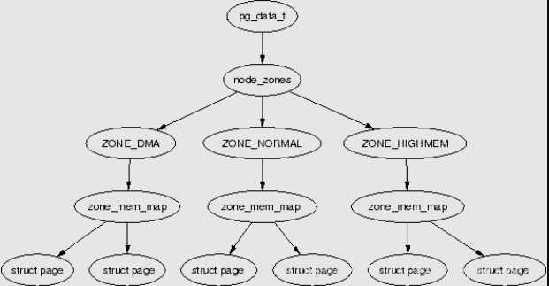
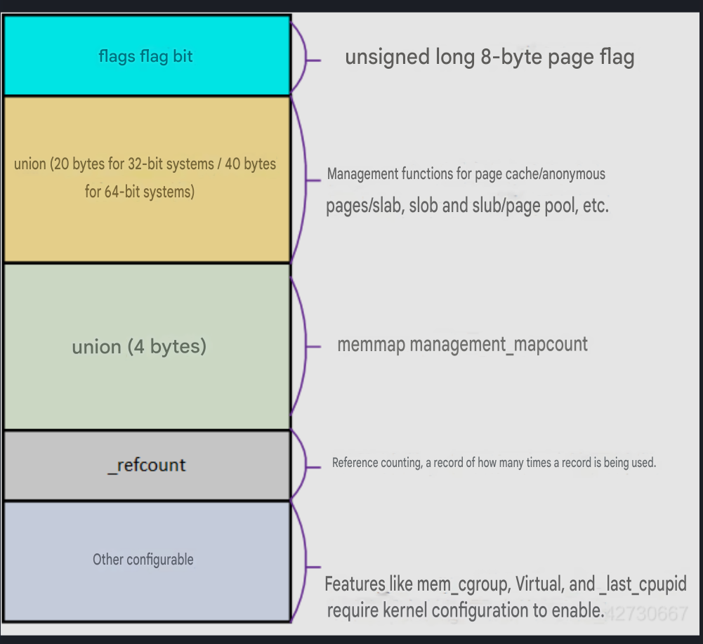
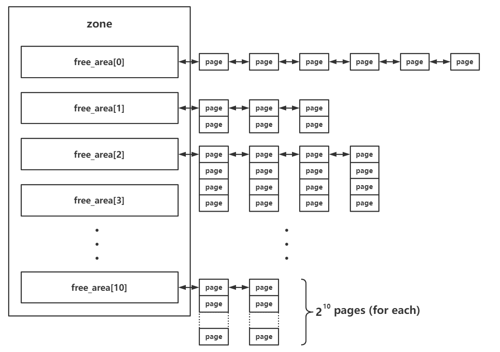
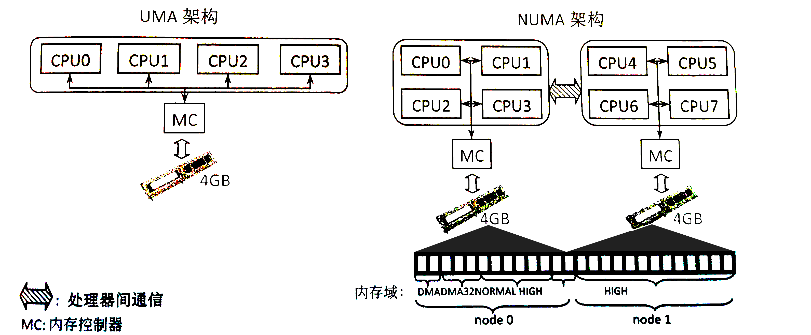
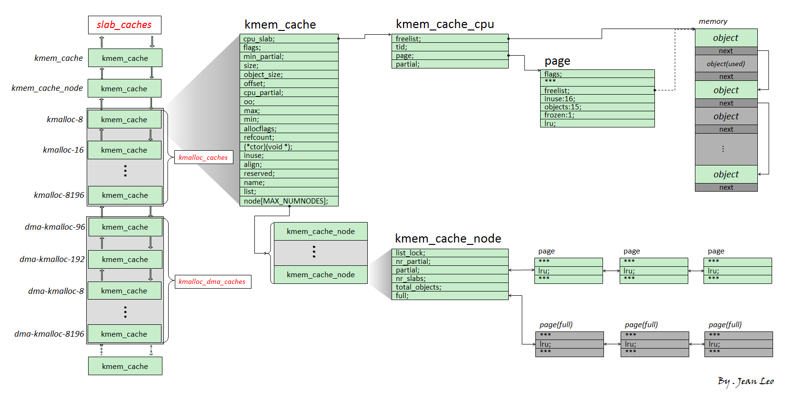

# Kernel Heap Overview

Similar to the heap in user-space processes, the kernel also has its own dynamic memory management mechanism. For convenience, we likewise refer to the dynamically allocated memory in the kernel as the "heap."

The Linux kernel divides memory into a three-level structure of `pages → zones → nodes`, and primarily has two memory managers — the `buddy system` and the `slab allocator`. The former is responsible for managing all available physical memory at page granularity, while the latter requests memory pages from the former and divides them into multiple smaller objects for fine-grained memory management.

## Page → Zone → Node Three-Level Structure

This is a very classic _Overview_. From top to bottom:

- **Node** (node, corresponding to the structure pgdata\_list)
- **Zone** (zone, corresponding to the structure zone; the diagram shows three types of zones)
- **Page** (page, corresponding to the structure page)



### Page

The Linux kernel uses the `page` structure to represent a physical page frame. **Each physical page frame has a corresponding page structure**:



### Zone

In Linux, memory regions with different purposes within a node are divided into different `zones`, corresponding to the structure `struct zone`:



### Node

One level above zones are **nodes** — Linux uses the _memory controller_ as the basis for node division. For UMA architectures there is only one node, while for NUMA architectures there are usually multiple nodes. For CPUs under the same memory controller, their corresponding node is called _local memory_, and different processors are further connected via a bus. As shown in the diagram below, one MC corresponds to one node:



## buddy system

The buddy system is a relatively low-level memory management system in the Linux kernel that **manages all physical memory at page granularity**. It exists at the **zone** level, managing all physical page frames owned by the corresponding zone.

Within each zone structure there is a free\_area structure array, used to store the **pages managed by the buddy system according to order**:

```c
struct zone {
    //...
    struct free_area	free_area[MAX_ORDER];
    //...
```

Here `MAX_ORDER` is a constant with the value 11.

In the buddy system, free pages are managed by tiers according to their contiguous size. The actual meaning of order here is **the size of contiguous free pages**, but the unit is not the number of pages, but rather the `order`. That is, the page size stored at each index is:

$$
2^{order}
$$

The pages stored in free\_area are connected into a doubly linked list structure through their corresponding fields, giving us this _Overview_:


  - Allocation:
    - First, the requested memory size is aligned up to the nearest power-of-2 number of memory pages, and then contiguous memory pages are taken from the corresponding index.
    - If the corresponding index's linked list is empty, memory pages will be taken from the next order, split in half, and placed into the current index's corresponding linked list before being returned to the upper-level caller. If the next order is also empty, this request process continues to even higher orders.
  - Deallocation:
    - The corresponding contiguous memory pages are released back to the corresponding linked list.
    - A check is performed to see if there are mergeable memory pages; if so, they are merged and placed into a higher-order linked list.

## slab allocator

The slab allocator is a finer-grained memory manager. It requests one or more contiguous memory pages from the buddy system, then divides them into equally sized **objects** and returns them to upper-level callers, achieving finer-grained memory management.

There are three versions of the slab allocator:

- slab (the original version, with a relatively complex mechanism and low efficiency)
- slob (an extremely simplified version for embedded scenarios and similar use cases)
- slub (an optimized version, **the current general-purpose version**)

### Basic Structure

The `slub` version of the allocator is the version shipped with the vast majority of modern Linux kernels. Therefore, this article primarily describes the slub allocator. Its basic structure is shown in the diagram below:



We refer to the single/multiple memory pages that the slub allocator requests from the buddy system each time as a `slub`. It is divided into multiple equally sized objects, with each object serving as an allocation entity. The freelist member on the page structure of the first memory page of a slub points to the first free object on that memory page. All free objects on a slub form a singly linked list terminated by NULL.

  > An object can be thought of as analogous to a chunk in user-space glibc, but unlike a chunk, an object does not need a header, because there is a linear correspondence between page structures and physical memory, allowing us to directly find the corresponding page structure from the object's address.

`kmem_cache` is a fundamental allocator component used to allocate objects of a specific size (or for a specific purpose). All kmem\_caches form a doubly linked list, and there are two corresponding structure arrays: `kmalloc_caches` and `kmalloc_dma_caches`.

A `kmem_cache` is primarily composed of two modules:

  - `kmem_cache_cpu`: This is a **percpu variable** (i.e., each core independently maintains its own copy, addressed using the gs register as the base address of the percpu segment). It represents the slub currently in use by the current core. Therefore, when the current CPU takes objects from kmem\_cache\_cpu, **no locking is required**, which greatly improves performance.
  - `kmem_cache_node`: This can be thought of as the slub distribution center for the current `kmem_cache`. It contains two slub linked lists:
    - partial: The slub has a certain number of free objects, but not all objects are free.
    - full: All objects on the slub have been allocated.

### Allocation/Deallocation Process

Now we can explain the allocation/deallocation behavior of the slub allocator:

  - Allocation:
    - First, attempt to take an object from `kmem_cache_cpu`. If one is available, return it directly.
    - If the slub on `kmem_cache_cpu` has no free objects, the corresponding slub is removed from `kmem_cache_cpu`, and an attempt is made to take a slub from the **partial** linked list and mount it onto `kmem_cache_cpu`, then a free object is taken and returned.
    - If the partial linked list on `kmem_cache_node` is also empty, **new memory pages are requested from the buddy system**, divided into multiple objects, and then given to `kmem_cache_cpu`, from which a free object is taken and returned to the upper-level caller.
  - Deallocation:
    - If the freed object belongs to the slub of `kmem_cache_cpu`, it is directly inserted at the head of the current CPU slub's freelist.
    - If the freed object belongs to a slub on the partial linked list of `kmem_cache_node`, it is directly inserted at the head of the corresponding slub's freelist.
    - If the freed object belongs to a full slub, it becomes the head node of the corresponding slub's freelist, **and that slub is placed onto the partial linked list**.

The above covers the basic principles of the slub allocator.

## REFERENCE

[https://arttnba3.cn/2021/11/28/OS-0X02-LINUX-KERNEL-MEMORY-5.11-PART-I/](https://arttnba3.cn/2021/11/28/OS-0X02-LINUX-KERNEL-MEMORY-5.11-PART-I/)

[https://arttnba3.cn/2022/06/30/OS-0X03-LINUX-KERNEL-MEMORY-5.11-PART-II/](https://arttnba3.cn/2022/06/30/OS-0X03-LINUX-KERNEL-MEMORY-5.11-PART-II/)

[https://arttnba3.cn/2023/02/24/OS-0X04-LINUX-KERNEL-MEMORY-6.2-PART-III/](https://arttnba3.cn/2023/02/24/OS-0X04-LINUX-KERNEL-MEMORY-6.2-PART-III/)

[https://blog.csdn.net/lukuen/article/details/6935068](https://blog.csdn.net/lukuen/article/details/6935068)

[https://www.cnblogs.com/LoyenWang/p/11922887.html](https://www.cnblogs.com/LoyenWang/p/11922887.html)
