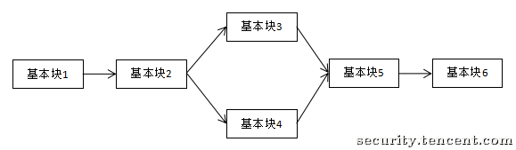
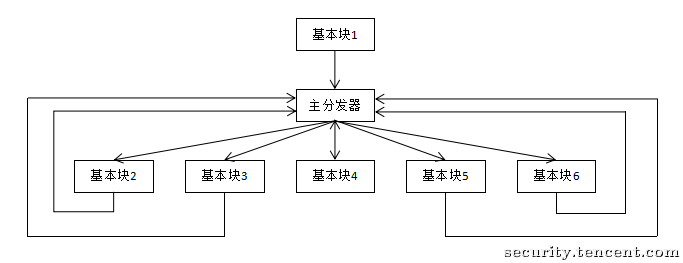

# Control Flow Flattening

## Introduction

Control flow flattening is a code obfuscation technique that operates on the control flow graph. Its basic idea is to reorganize the relationships between basic blocks in a function's control flow graph by inserting a "main dispatcher" to control the execution flow of basic blocks. For example, the following is a normal execution flow:

After control flow flattening, it becomes like this, with a "main dispatcher" responsible for controlling the program execution flow:

Through control flow flattening, the predecessor-successor relationships between basic blocks are obfuscated, thereby increasing the difficulty of reverse analysis. For more implementation details on control flow flattening, refer to [this paper](http://ac.inf.elte.hu/Vol_030_2009/003.pdf).

## Using Symbolic Execution to Remove Control Flow Flattening

> Under construction.

## Reference

[Tencent Security Response Center - Using Symbolic Execution to Remove Control Flow Flattening](https://security.tencent.com/index.php/blog/msg/112)

[OBFUSCATING C++ PROGRAMS VIA CONTROL FLOW FLATTENING](http://ac.inf.elte.hu/Vol_030_2009/003.pdf)
